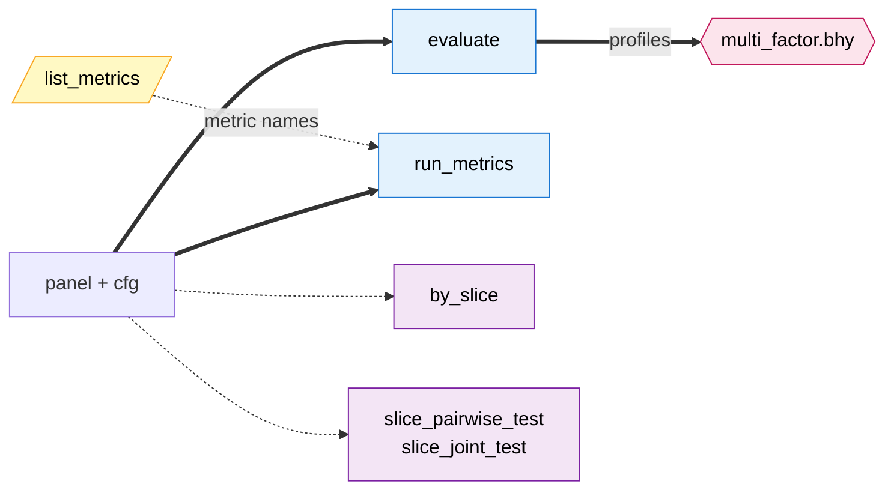

# API

Reference for every public symbol exported from `factrix`.

## Verb map

Click any node to jump to its API page.

**Edge convention.** Solid `==>` is a hard signature dependency — the target verb's call signature takes the source object literally (e.g. `evaluate(panel, cfg)` consumes the input `P`, and `multi_factor.bhy` consumes a list of `FactorProfile`s that only `evaluate` produces). Dashed `-.->` is a suggested workflow — the source is panel-derived but the target verb's signature differs in shape (`by_slice` / `slice_pairwise_test` / `slice_joint_test` accept `(metric, metric_df, label=…)`, where `metric_df` is a per-date frame built from the panel via e.g. `compute_ic(panel)`; `list_metrics` returns candidate names you pass to `run_metrics(metrics=[…])`).

**Node category** (background colour):

- **Compute** (blue) — `evaluate` / `run_metrics`. Produce primary artefacts (`FactorProfile` / `MetricsBundle`) from `(panel, cfg)`.
- **Decision** (pink) — `multi_factor.bhy`. Multiplicity-correction primitive; consumes `Profile[]`.
- **View** (purple) — `by_slice` / `slice_pairwise_test` / `slice_joint_test`. Render or test a derived view of a metric. (`by_slice` is the dispatcher; the `_test` pair are statistical tests over the slices — both share the slice-surface shape per #148, hence one bucket.)
- **Introspection** (yellow) — `list_metrics`. Discovers what's applicable to a cell.

**Deliberately omitted from the graph (not yet implemented).** The full v1 design (#148) also covers `compare` (cross-factor leaderboard), `robustness` (per-stat-choice sensitivity), and the family verbs `bhy_hierarchical` / `partial_conjunction` for hierarchical FDR and partial-conjunction multiplicity control. All four are view-class or decision-class verbs that depend on the same artefact shapes shown above. They are not drawn because drawing them would either mislead a reader into clicking a URL that 404s, or force a legend explaining which nodes are real — both worse than the small omission.

## Typical patterns

| Goal | Pipeline |
|---|---|
| Single-factor inference | `evaluate(panel, cfg)` → read `FactorProfile.primary_p` |
| Single-factor descriptive scan | `run_metrics(panel, cfg, factor_col=...)` → read `MetricsBundle` |
| Slice exploration (single axis) | `by_slice(metric, df, label="...")` → `SliceResult` |
| Slice statistical test | `slice_pairwise_test(metric, df, label="...")` or `slice_joint_test(...)` → pairwise / omnibus test result |
| Cell metric discovery | `list_metrics(scope, signal)` → names → `run_metrics(metrics=[...])` |
| Multi-factor screening with FDR | `[evaluate(panel, cfg_i) for cfg_i in cfgs]` → `multi_factor.bhy(profiles)` |

See the [Slice analysis guide](../guides/slice-analysis.md) for the slice surface end-to-end, and the [Batch screening with BHY](../guides/batch-screening.md) guide for the multi-factor screening workflow.

## Entry points

| Page | What it is | When to read |
|---|---|---|
| [`AnalysisConfig`](analysis-config.md) | Three-axis frozen dataclass selecting the dispatch cell. Four factory methods (`individual_continuous`, `individual_sparse`, `common_continuous`, `common_sparse`). | Picking the analysis cell. |
| [`evaluate`](evaluate.md) | Single dispatch entry — runs the registered procedure for a `(config, panel)` pair and returns a `FactorProfile`. | Running an analysis. |
| [`FactorProfile`](factor-profile.md) | Frozen result object: `primary_p`, `diagnose()`, `stats`, `warnings`, `info_notes`, `mode`, `n_obs`, `n_assets`. | Reading the result. |
| [`multi_factor`](multi-factor.md) | `bhy(...)` for per-family BHY FDR screening across a list of `FactorProfile`s. | Multi-factor screening. |
| [`stats`](stats.md) | Estimator catalogue (`NeweyWest` / `HansenHodrick` / `WaldNWCluster` / `WaldTwoWayCluster` / `BlockBootstrap`), StatCode pairs, FDR / bootstrap utilities. | Picking inference method for `bhy(estimator=…)` or cross-slice tests. |
| [`list_metrics`](list-metrics.md) | Programmatic discovery of standalone `factrix.metrics.*` callables applicable to a given `(scope, signal)` cell. | Picking a follow-up metric after `evaluate()`. |
| [`suggest_config`](suggest-config.md) | Heuristic introspection — inspect a raw panel, propose an `AnalysisConfig` with per-axis reasoning and pre-evaluate warnings. | Recovering from `MissingConfigError`, or letting an agent pick a starting cell. |
| [`Metrics`](metrics/index.md) | Per-module reference for every public function under `factrix.metrics`. | Calling a standalone metric directly on a `FactorProfile` / panel. |

## Supporting surface

| Page | What it is |
|---|---|
| [`MetricOutput`](metric-output.md) | Common wrapper returned by every standalone metric — `value`, `p_value`, `stats`, `metadata`. |
| [`datasets`](datasets.md) | Synthetic panels (`make_cs_panel`, `make_event_panel`) for smoke tests and docs examples. |

`describe_analysis_modes` is an introspection shim documented inline
on [`AnalysisConfig`](analysis-config.md) and
[Concepts](../getting-started/concepts.md).

## Naming convention

Sidebar entries mirror the actual Python identifier — the case
distinction is intentional, not inconsistent:

| Sidebar entry | Identifier kind | Example call |
|---|---|---|
| `AnalysisConfig`, `FactorProfile`, `MetricOutput` | Class | `fx.AnalysisConfig.individual_continuous(...)` |
| `evaluate`, `list_metrics` | Function | `fx.evaluate(panel, cfg)` |
| `multi_factor`, `datasets`, `Metrics` (and submodules) | Module | `fx.multi_factor.bhy(profiles)` |
