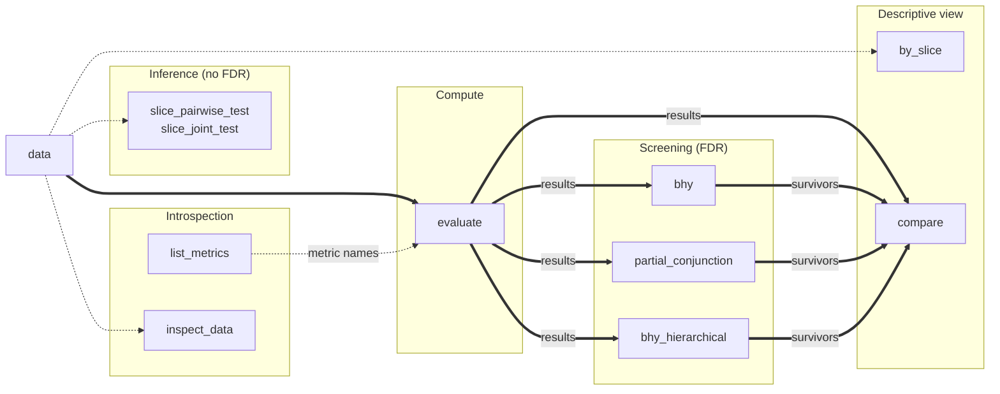

Reference for every public symbol exported from `factrix`.

## Function flow

Click any node to jump to its API page.

**Edge convention:**

- **Solid `==>` — hard signature dependency.** The target's call signature accepts the source object.
    - `evaluate(data, metrics=...)` consumes `P` (data).
    - `bhy` / `partial_conjunction` / `bhy_hierarchical` consume `evaluate` outputs (`list[EvaluationResult]`).
- **Dashed `-.->` — suggested workflow.** The source is data-derived, but the target's signature differs in shape.

---

## Typical patterns

| Goal | Pipeline |
|---|---|
| Single-factor/multi-factor inference | `evaluate(data, metrics=...)` → `list[EvaluationResult]` |
| Slice exploration (single axis) | `by_slice(data, metric, by="...", factor_col="...")` → `dict[str, EvaluationResult]` |
| Slice statistical test | `slice_pairwise_test(df, metric, by="...")` or `slice_joint_test(...)` → pairwise / omnibus test result |
| Metric catalog discovery | `list_metrics()` → family-grouped `dict` of specs |
| Per-panel applicability | `inspect_data(data)` → `.usable` / `.degraded` / `.unusable` |
| Multi-factor screening with FDR | `evaluate(...)` → `multi_factor.bhy(results, metrics=[...])` |
| Cross-factor leaderboard | `compare(results, metrics=[...])` → `pl.DataFrame` |

See the [Slice analysis guide](../guides/slice-analysis.md) for the slice surface end-to-end.

---

## Entry points

| Page | Category | What it is | When to read |
|---|---|---|---|
| [`evaluate`](evaluate.md) | Compute | Single dispatch entry — runs the registered metrics on a panel and returns the evaluation results. | Running an analysis. |
| [`by_slice`](by-slice.md) | Descriptive view | Partition a panel on a column and run `evaluate` per slice; returns `dict[str, EvaluationResult]`. | Per-slice metric exploration. |
| [`slice_pairwise_test` / `slice_joint_test`](slice-test.md) | Inference (no FDR) | Statistical tests over slice families (pairwise / omnibus). | Testing whether slice means differ. |
| [`multi_factor`](multi-factor.md) | Screening (FDR) | Module-level overview of collection-level FDR functions. | Multi-factor FDR screening overview. |
| [`bhy`](bhy.md) | Screening (FDR) | Benjamini-Hochberg-Yekutieli step-up FDR. | Screening candidate factors. |
| [`partial_conjunction`](partial-conjunction.md) | Screening (FDR) | k-of-m partial conjunction screening. | "Factor passes in ≥ k of m contexts." |
| [`bhy_hierarchical`](bhy-hierarchical.md) | Screening (FDR) | Two-stage hierarchical BHY FDR. | Grouped / nested-context screening. |
| [`compare`](compare.md) | Descriptive view | Cross-factor leaderboard — stacks evaluation results into a `pl.DataFrame`. | Ranking candidate factors. |
| [`list_metrics`](metrics/index.md#factrix.list_metrics) | Introspection | Family-grouped catalog of standalone public metrics. | Browsing the metric catalog. |
| [`inspect_data`](inspect-data.md) | Introspection | Inspects a panel's applicability metrics. | Pre-flight check on data dimensions. |
| [`Metrics`](metrics/index.md) | Catalogue | Per-module reference for every public function under `factrix.metrics`. | Calling a standalone metric directly. |
| [`stats`](stats.md) | Catalogue | Statistical estimators and HAC/bootstrap utilities. | Under-the-hood statistical details. |

---

## Supporting surface

| Page | What it is |
|---|---|
| [Panel schema](panel-schema.md) | The four-column input contract every panel-consuming function depends on. |
| [`EvaluationResult`](evaluation-results.md) | The bundle result returned by `evaluate`. Includes groups, metric results, and warnings. |
| [`datasets`](datasets.md) | Synthetic panels for testing and examples. |
| [`preprocess`](preprocess.md) | Helper functions for preprocessing (e.g. computing forward returns). |

## Naming convention

Sidebar entries mirror the actual Python identifier:

| Sidebar entry | Identifier kind | Example call |
|---|---|---|
| `EvaluationResult` | Class | `fx.EvaluationResult` |
| `evaluate`, `inspect_data` | Function | `fx.evaluate(data, metrics=...)` |
| `multi_factor`, `datasets`, `Metrics` | Module | `fx.multi_factor.bhy(results, metrics=[...])` |
