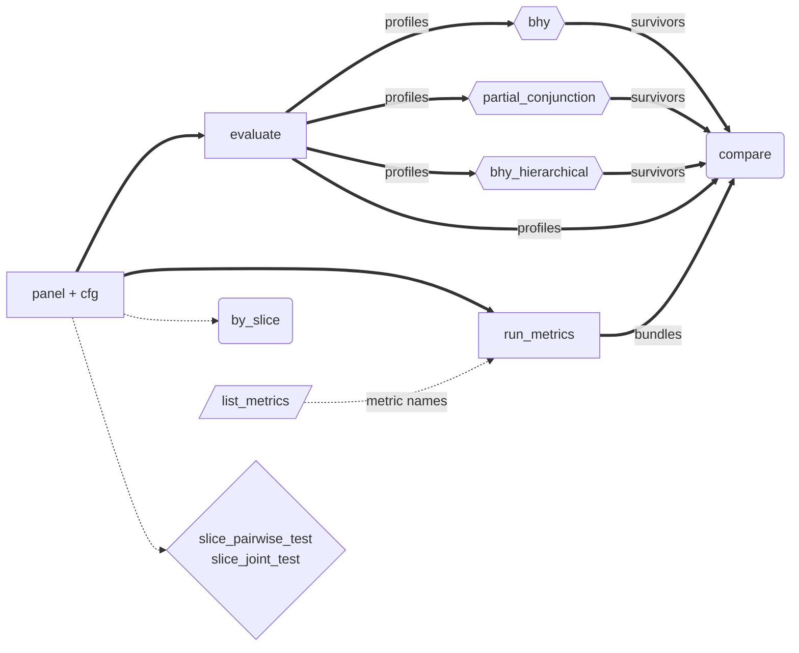

# API

Reference for every public symbol exported from `factrix`.

## Function flow

Click any node to jump to its API page.

**Edge convention:**

- **Solid `==>` — hard signature dependency.** The target's call signature literally accepts the source object.
    - `evaluate(panel, cfg)` consumes `P` (the panel).
    - `bhy` / `partial_conjunction` / `bhy_hierarchical` consume `list[FactorProfile]`, which only `evaluate` produces.
- **Dashed `-.->` — suggested workflow.** The source is panel-derived, but the target's signature differs in shape.
    - `by_slice` / `slice_pairwise_test` / `slice_joint_test` accept `(metric, metric_df, label=…)`, where `metric_df` is a per-date frame the caller builds from the panel (e.g. `compute_ic(panel)`).
    - `list_metrics` returns candidate names the caller forwards to `run_metrics(metrics=[…])`.

**Category encoding by node shape:**

| Shape | Category | Behaviour |
|---|---|---|
| Rectangle `[ ]` | **Compute** | Produces primary artefact from `(panel, cfg)` |
| Hexagon `{{ }}` | **Screening (FDR)** | Multiplicity-correction primitive; `Profile[] → Survivors` |
| Diamond `{ }` | **Inference (no FDR)** | Re-computes statistical tests; family-internal MTC only, no cell-level FDR claim |
| Rounded `( )` | **Descriptive view** | Render or aggregate existing artefacts; no fresh statistics |
| Parallelogram `[/ /]` | **Introspection** | Discover what is applicable to a cell |

> The sixth category, **Compare-sensitivity** (`by_estimator`, #178), is not drawn — it lands in v0.14 once #263 unblocks HACEstimator parameter config + catalog expansion.

---

## Typical patterns

| Goal | Pipeline |
|---|---|
| Single-factor inference | `evaluate(panel, cfg)` → read `FactorProfile.primary_p` |
| Single-factor descriptive scan | `run_metrics(panel, cfg, factor_col=...)` → read `MetricsBundle` |
| Slice exploration (single axis) | `by_slice(metric, df, label="...")` → `SliceResult` |
| Slice statistical test | `slice_pairwise_test(metric, df, label="...")` or `slice_joint_test(...)` → pairwise / omnibus test result |
| Cell metric discovery | `list_metrics(scope, signal)` → names → `run_metrics(metrics=[...])` |
| Multi-factor screening with FDR | `[evaluate(panel, cfg_i) for cfg_i in cfgs]` → `multi_factor.bhy(profiles)` |
| Cross-factor leaderboard | `compare(profiles)` / `compare(bundles)` / `compare(survivors)` → `pl.DataFrame` |

See the [Slice analysis guide](../guides/slice-analysis.md) for the slice surface end-to-end, and the [Batch screening with BHY](../guides/batch-screening.md) guide for the multi-factor screening workflow.

---

## Entry points

| Page | Category | What it is | When to read |
|---|---|---|---|
| [`AnalysisConfig`](analysis-config.md) | Configuration | Three-axis frozen dataclass selecting the dispatch cell. Four factory methods (`individual_continuous`, `individual_sparse`, `common_continuous`, `common_sparse`). | Picking the analysis cell. |
| [`evaluate`](evaluate.md) | Compute | Single dispatch entry — runs the registered procedure for a `(config, panel)` pair and returns a `FactorProfile`. | Running an analysis. |
| [`run_metrics`](run-metrics.md) | Compute | Descriptive twin of `evaluate` — fans out across all standalone metrics in the cell, returns a `MetricsBundle`. | Descriptive scan of a cell. |
| [`by_slice`](by-slice.md) | Descriptive view | Slice a metric over a label column; returns a `SliceResult` with `.to_frame()` rendering. | Per-slice metric exploration. |
| [`slice_pairwise_test` / `slice_joint_test`](slice-test.md) | Inference (no FDR) | Statistical tests over slice families (pairwise / omnibus) with family-internal MTC. No cell-level FDR claim. | Testing whether slice means differ. |
| [`multi_factor`](multi-factor.md) | Screening (FDR) | `bhy(...)` for BHY FDR screening across a `Profile[]`; `expand_over=` opens hypothesis-dimension expansion. | Multi-factor FDR screening. |
| [`partial_conjunction`](partial-conjunction.md) | Screening (FDR) | k-of-m partial conjunction p-values (Benjamini-Heller 2008) → BHY. | "Factor X passes in ≥ k of m contexts." |
| [`bhy_hierarchical`](bhy-hierarchical.md) | Screening (FDR) | Hierarchical FDR (Yekutieli 2008) — outer BHY on group representatives, inner BHY within passing groups. | Factor families / nested-context structure. |
| [`compare`](compare.md) | Descriptive view | Cross-factor leaderboard — stacks `FactorProfile` / `MetricsBundle` / `Survivors` artifacts into a `pl.DataFrame` (no recompute). | Ranking N candidate factors. |
| [`list_metrics`](list-metrics.md) | Introspection | Programmatic discovery of standalone `factrix.metrics.*` callables applicable to a `(scope, signal)` cell. | Picking a follow-up metric after `evaluate()`. |
| [`list_estimators`](list-estimators.md) | Introspection | Estimators applicable to a cell — inference-side twin of `list_metrics`. | Picking `estimator=` for family verbs. |
| [`suggest_config`](suggest-config.md) | Introspection | Inspect a raw panel; propose an `AnalysisConfig` with per-axis reasoning + pre-evaluate warnings. | Recovering from `MissingConfigError`, agent pickers. |
| [`Metrics`](metrics/index.md) | Catalogue | Per-module reference for every public function under `factrix.metrics`. | Calling a standalone metric directly. |
| [`stats`](stats.md) | Catalogue | Estimator catalogue (`NeweyWest` / `HansenHodrick` / `WaldNWCluster` / `WaldTwoWayCluster` / `BlockBootstrap`), StatCode pairs, FDR / bootstrap utilities. | Picking an inference method to pass through `estimator=`. |

---

## Supporting surface

| Page | What it is |
|---|---|
| [Panel schema](panel-schema.md) | The four-column input contract every panel-consuming function depends on. |
| [`FactorProfile`](factor-profile.md) | Frozen result of `evaluate`: `primary_p`, `diagnose()`, `stats`, `warnings`, `info_notes`. |
| [`MetricsBundle`](metrics-bundle.md) | Frozen result of `run_metrics`: per-metric `MetricOutput` map + identity. |
| [`MetricOutput`](metric-output.md) | Common wrapper returned by every standalone metric — `value`, `p_value`, `stats`, `metadata`. |
| [`datasets`](datasets.md) | Synthetic panels (`make_cs_panel`, `make_event_panel`) for smoke tests and docs examples. |

`describe_analysis_modes` is an introspection shim documented inline
on [`AnalysisConfig`](analysis-config.md) and
[Concepts](../getting-started/concepts.md).

---

## Naming convention

Sidebar entries mirror the actual Python identifier — the case
distinction is intentional, not inconsistent:

| Sidebar entry | Identifier kind | Example call |
|---|---|---|
| `AnalysisConfig`, `FactorProfile`, `MetricOutput` | Class | `fx.AnalysisConfig.individual_continuous(...)` |
| `evaluate`, `list_metrics` | Function | `fx.evaluate(panel, cfg)` |
| `multi_factor`, `datasets`, `Metrics` (and submodules) | Module | `fx.multi_factor.bhy(profiles)` |
