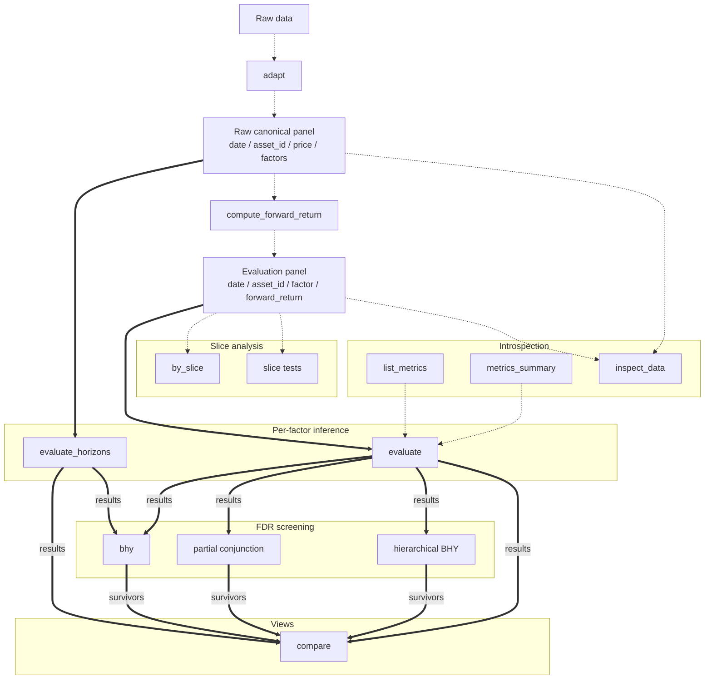

Reference for every public symbol exported from `factrix`.

## Data and result flow



Click any node to jump to its API page.

**Panel contracts:**

| Panel | Minimum columns | Used by |
|---|---|---|
| Raw canonical panel | `date`, `asset_id`, `price`, factor column(s) | `evaluate_horizons`; it computes `forward_return` internally for each horizon. `inspect_data` can pre-flight the factor shape before returns are attached. |
| Evaluation panel | `date`, `asset_id`, factor column(s), `forward_return` | `evaluate`, slice analysis, `inspect_data`, and most metric dispatch. |

**Edge convention:**

- **Solid `==>`: primary statistical handoff.** `evaluate(panel, ...)` consumes
  an evaluation panel; `evaluate_horizons(raw, ...)` consumes a raw canonical
  panel; FDR functions consume `list[EvaluationResult]`.
- **Dashed `-.->`: preparation, inspection, or descriptive flow.** These calls
  help shape, inspect, or view the analysis input/output without changing the
  main inference-to-screening path.

`adapt(...)` is optional when the source already uses factrix's canonical names,
but it is the documented bridge from vendor columns to `date`, `asset_id`,
`price`, and optional OHLCV canonicals. For fixed-horizon `evaluate`, attach
`forward_return` first with `compute_forward_return`. For horizon sweeps, pass
the raw canonical panel to `evaluate_horizons`; it rebuilds `forward_return` for
each requested horizon.

**Inference vs screening:**

- **Inference** produces a p-value for one hypothesis. `evaluate` and
  `evaluate_horizons` do this per factor; `slice_*_test` functions test across
  slices of one factor. None of these corrects for testing many candidates.
- **Screening** starts after inference. `bhy`, `partial_conjunction`, and
  `bhy_hierarchical` take `list[EvaluationResult]` and control false discoveries
  across the declared family.
- **Views** such as `by_slice` and `compare` arrange or rank results; they do
  not add another statistical test.

---

## Typical patterns

| Goal | Pipeline |
|---|---|
| Bring external data into factrix's schema | `adapt(raw, date=..., asset_id=..., price=...)` -> canonical column names |
| Fixed-horizon inference | `evaluate(panel, metrics=...)` on an evaluation panel -> `dict[str, EvaluationResult]` |
| Multi-horizon sweep | `evaluate_horizons(raw, metrics=..., forward_periods=[...])` on a raw canonical panel -> `list[EvaluationResult]` |
| Slice exploration | `by_slice(panel, metric, by="...", factor_col="...")` -> `dict[str, EvaluationResult]` |
| Slice statistical test, date-aligned | `slice_pairwise_test(panel, metric, by="...")` or `slice_joint_test(...)` -> pairwise / omnibus result |
| Slice statistical test, date-disjoint | `slice_period_pairwise_test(...)` or `slice_period_joint_test(...)` -> pairwise / omnibus result across regimes or calendar periods |
| Metric catalog discovery, full specs | `list_metrics()` -> family-grouped `dict` of specs |
| Metric catalog discovery, browse | `metrics_summary()` -> `pl.DataFrame` of `(family, metric, summary)` |
| Per-panel applicability | `inspect_data(raw_or_panel)` -> `.usable` / `.degraded` / `.unusable` |
| Multi-factor screening with FDR | `evaluate(...)` -> `multi_factor.bhy(list(results.values()), metrics=[...])` |
| Cross-factor leaderboard | `compare(list(results.values()), metrics=[...])` -> `pl.DataFrame` |

See the [Slice analysis guide](../guides/slice-analysis.md) for the slice surface end-to-end.

---

## Entry points

| Page | Category | What it is | When to read |
|---|---|---|---|
| [`evaluate`](evaluate.md) | Inference (per factor) | Runs registered metrics on an evaluation panel and returns one result per factor. | Running fixed-horizon analysis. |
| [`evaluate_horizons`](multi-horizon.md) | Inference (per factor) | Rebuilds `forward_return` from one raw panel for each requested horizon, then evaluates each panel. | Multi-horizon analysis / sweeping. |
| [`by_slice`](by-slice.md) | Descriptive view | Partitions a panel on one column and runs `evaluate` per slice. | Per-slice metric exploration. |
| [`slice_*_test` family](slice-test.md) | Inference (across slices) | Pairwise / omnibus tests over date-aligned or date-disjoint slice families. | Testing whether slice means differ. |
| [`multi_factor`](multi-factor.md) | Screening (FDR) | Module-level overview of collection-level FDR functions. | Multi-factor FDR screening overview. |
| [`bhy`](bhy.md) | Screening (FDR) | Benjamini-Hochberg-Yekutieli step-up FDR. | Screening candidate factors. |
| [`partial_conjunction`](partial-conjunction.md) | Screening (FDR) | k-of-m partial conjunction screening. | "Factor passes in k of m contexts." |
| [`bhy_hierarchical`](bhy-hierarchical.md) | Screening (FDR) | Two-stage hierarchical BHY FDR. | Grouped / nested-context screening. |
| [`compare`](compare.md) | Descriptive view | Cross-factor leaderboard; stacks evaluation results into a `pl.DataFrame`. | Ranking candidate factors. |
| [`list_metrics`](metrics/index.md#factrix.list_metrics) | Introspection | Family-grouped catalog of public metric specs. | Programmatic browsing over the metric catalog. |
| [`metrics_summary`](metrics/index.md#factrix.metrics_summary) | Introspection | One-line-per-metric `pl.DataFrame` (`family`, `metric`, `summary`). | Browsing the metric catalog at a glance. |
| [`inspect_data`](inspect-data.md) | Introspection | Inspects a panel's applicable, degraded, and unusable metrics. | Pre-flight check on data dimensions. |
| [`Metrics`](metrics/index.md) | Catalogue | Per-module reference for every public function under `factrix.metrics`. | Calling a standalone metric directly. |
| [`stats`](stats.md) | Catalogue | Statistical estimators and HAC/bootstrap utilities. | Under-the-hood statistical details. |

---

## Supporting surface

| Page | What it is |
|---|---|
| [Data schema](data-schema.md) | The four-column evaluation-panel contract used by fixed-horizon metric dispatch. |
| [`EvaluationResult`](evaluation-results.md) | The bundle result returned by `evaluate`. Includes groups, metric results, and warnings. |
| [`datasets`](datasets.md) | Synthetic panels for testing and examples. |
| [`adapt`](preprocess.md#factrix.adapt.adapt) / [`preprocess`](preprocess.md) | Column-name adaptation plus helpers for preprocessing, including forward returns. |

## Naming convention

Sidebar entries mirror the actual Python identifier:

| Sidebar entry | Identifier kind | Example call |
|---|---|---|
| `EvaluationResult` | Class | `fx.EvaluationResult` |
| `evaluate`, `inspect_data` | Function | `fx.evaluate(panel, metrics=...)` |
| `multi_factor`, `datasets`, `Metrics` | Module | `fx.multi_factor.bhy(list(results.values()), metrics=[...])` |

An importable submodule is not automatically a callable. For example,
`from factrix.metrics import spanning` can resolve the `spanning` module, so
passing it to `inspect.signature()` or calling it raises `TypeError`. Import the
documented function or class instead:

```python
from factrix.metrics import spanning_alpha
from factrix.preprocess import orthogonalize_factor
from factrix.stats import DriscollKraay
```

For registered metric names, use [`metrics_summary()` or `list_metrics()`](metrics/index.md#programmatic-discovery).
For preprocessing, statistics, and slicing, use the identifiers listed in their
API pages rather than inferring callability from module filenames or `dir()`
output.
