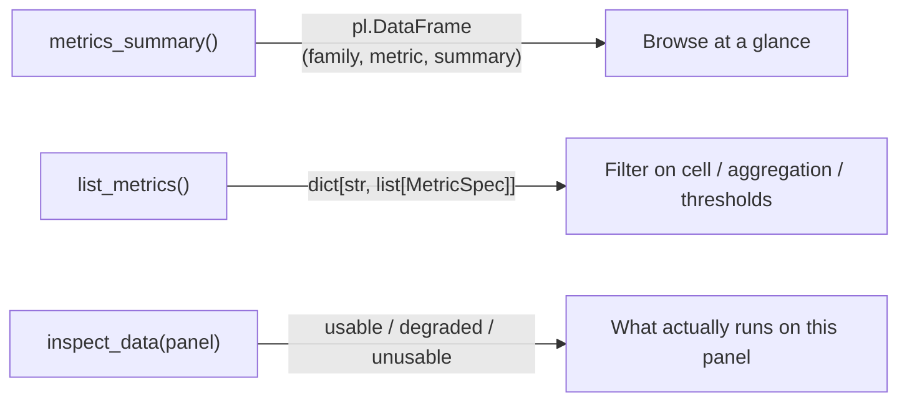

Public metric functions in `factrix.metrics`. Each page is autogenerated
from the module's docstrings (Google style); private helpers prefixed
with `_` are not rendered.

This page is the API catalog for public metric callables. If you are
deciding which metric to run first, start with the task-oriented
[Choosing a metric](../../guides/choosing-metric.md) guide; return here
when you know the family or callable name and need signatures, specs, or
standalone-call details.

## Programmatic discovery

Three entry points browse the metric surface — pick by how much detail you need:



| Function | Returns | Use when |
|---|---|---|
| `metrics_summary()` | `pl.DataFrame` — one row per metric: `family`, `metric`, `summary` | You want a readable, at-a-glance catalog. |
| `list_metrics()` | `dict[str, list[MetricSpec]]` — full specs, family-grouped | You need the full `MetricSpec` to filter programmatically. |
| `inspect_data(panel)` | `usable` / `degraded` / `unusable` partitions | You need to know which metrics run on a **specific** panel. |

### Browse the catalog: `metrics_summary()`

::: factrix.metrics_summary

### Full specs: `list_metrics()`

::: factrix.list_metrics

`list_metrics()` is the programmatic form of the index above. It takes
**no arguments** and returns a family-grouped catalog — a
`dict[str, list[MetricSpec]]` keyed by concept family (the declaring
module stem):

```python
import factrix as fx

overview = fx.list_metrics()
overview["ic"]       # [MetricSpec(name="ic", ...), MetricSpec(name="ic_ir", ...), ...]
sorted(overview)     # ['caar', 'fm_beta', 'ic', ...] — the concept families
```

The catalog is a *reference*, not a runnable input — wire concrete
callables up from `factrix.metrics` and pass them to
[`evaluate`](../evaluate.md):

```python
from factrix.metrics import ic, fm_beta, breakeven_cost
```

### Per-cell applicability → `inspect_data`

`list_metrics()` takes no cell filter. To learn which metrics actually
run on a given panel — and which are degraded or blocked by sample
floors — inspect a real panel with `inspect_data`:

```python
info = fx.inspect_data(panel)
[m.name for m in info.usable]     # production-safe metrics for this panel
[m.name for m in info.degraded]   # run, but inference degraded
[m.name for m in info.unusable]   # blocked (cell mismatch / sample floor)
```

`inspect_data` gives a cell-aware, sample-floor-aware verdict: each
`MetricApplicability` carries the metric `name`, its callable class, and
any `blockers` / `warnings`, accounting for the actual panel shape
(`n_periods` / `n_assets` / `n_pairs`).

## Cell vs. DataStructure

factrix has **two orthogonal classifications**:

| | Describes | Set by | Values |
|---|---|---|---|
| **Cell** (`Scope × FactorDensity`) | What kind of factor it is | The user, via metrics selection | `Individual` / `Common`; `Dense` / `Sparse` |
| **DataStructure** | Sample regime | Derived from asset count (`n_assets`) at evaluate-time | `PANEL` (`n_assets >= 2`) / `TIMESERIES` (`n_assets == 1`) |

**This page groups metrics by *cell*, not by DataStructure.** A metric's
registered `MetricSpec` still decides whether it can run on the derived
structure. `Common × Dense` metrics live under **Common continuous** below,
but their registered structure is `PANEL`; at `n_assets == 1` they raise
`IncompatibleAxisError` (or return NaN with `structure_mismatch` under
`strict=False`) rather than silently switching to a single-series beta.
Single-asset dense workflows use `predictive_beta` for direct
predictive-regression slope inference and `directional_hit_rate` for sign
prediction. Single-asset sparse workflows use sparse metrics whose cell
wildcard allows `TIMESERIES`. Two-column diagnostics such as `hit_rate` /
`oos_decay` / `ic_trend` are standalone `(date, value)` tools; in
`evaluate()` they layer on panel IC series, not raw single-asset dense panels.

See [Concepts](../../getting-started/concepts.md) for the full
three-axis design and how metrics map to cells.

## Layout

The four `Scope × FactorDensity` cells map to **three groups of metric
modules plus a fourth axis-agnostic group**:

| Cell | Group on this nav | Notes |
|---|---|---|
| `Individual × Dense` | **Individual continuous** | Both `IC` and `FM` inferential metrics live in this cell; ancillary metrics (`quantile`, `monotonicity`, `concentration`, `tradability`, `spanning`) are shared across both. |
| `Individual × Sparse` | **Individual sparse** | Per-event tests on `(date, asset_id, factor)` with sparse `{0, R}` schema (zero on non-event entries; `R` is any real magnitude, `{0, 1}` is the simplest form). Domain shorthand: *event signal*. |
| `Common × Sparse` | **Common sparse** | A market-wide event dummy broadcast across `n_assets` assets, with the `{0, R}` sparse signal shape. Evaluated through the same scope-agnostic event-time metrics as Individual sparse (CAAR significance plus event diagnostics) — not the time-series-first OLS-β flow. |
| `Common × Dense` | **Common continuous** | Single time series broadcast across assets (VIX, USD index, …). |

**Single-asset dense** (`predictive_beta`) is the explicit
`DataStructure.TIMESERIES` path for `n_assets == 1`: it runs a direct
`forward_return ~ factor` predictive regression with Newey-West HAC
inference. It is deliberately separate from `ts_beta`, whose estimand is
the cross-asset mean of per-asset betas.

**Series diagnostics** (`hit_rate`, `trend`, `oos_decay`) are standalone
axis-agnostic helpers on `(date, value)` inputs. Their `evaluate()` path is
the panel IC-series path (`compute_ic` → diagnostic), so their registered
cell reflects that producer contract. `directional_hit_rate` lives near them
because it is also a sign diagnostic, but it is panel-input:
`(date, asset_id, factor, forward_return)`. Distinct from
`DataStructure.TIMESERIES`, which is the dispatch regime for `n_assets == 1`.

**Sparse single-asset workflows** stay in the event-density model. `{0, R}` and
`{-R, 0, +R}` columns route to CAAR / BMP / event-quality metrics, preserving
event semantics rather than becoming a time-series beta. Always-in-market
`{-1, +1}` columns are dense directional signals because they have no non-event
zero state.

**What stays out of `evaluate()`**: strategy return metrics (Sharpe, Sortino,
max drawdown, Calmar, annualized return), execution-cost metrics (slippage,
market impact, borrow cost, liquidity capacity), threshold sweeps that select
the best entry/exit cutoff, and walk-forward optimization. Those require a
trading rule, portfolio weights, execution assumptions, or model-selection
discipline. factrix evaluates factor density; feed screened factors into a
backtest or execution simulator downstream.

## How to read a metric page

Each module page has, per public function:

- **Signature** with type annotations.
- **Args / Returns** summary.
- **Notes** — formula sketch (2-5 lines) and a one-liner on any
  intentional deviation from the textbook form.
- **References** — `[Author Year][anchor]` cross-refs into the
  [Bibliography](../../reference/bibliography.md).

For the cell-level applicability matrix (which metric in which cell,
sample-size guards) see
[Reference § Metric applicability](../../reference/metric-applicability.md).
