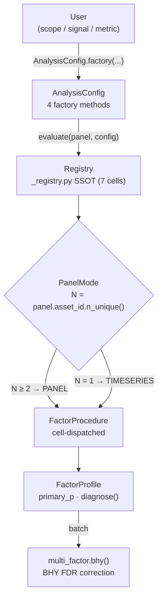

Current-state snapshot of the public API surface and internal layout.

---

## Positioning

**factrix is a Factor FactorSignal Validator, not a backtest engine.**

The library produces a single `primary_p` per factor cell from a Newey-West (NW) heteroskedasticity-and-autocorrelation-consistent (HAC)-corrected
canonical procedure (information coefficient (IC) / FM-λ / CAAR / TS-β). Realistic execution simulation,
tradability proxies, and portfolio construction are out of scope — feed
screened factors into Zipline / Backtrader / `vectorbt` downstream.

---

## Global architecture



The single `FactorProcedure` node above stands in for the seven concrete
procedures (`_ICContPanelProcedure`, `_FMContPanelProcedure`,
`_CAARSparsePanelProcedure`, `_CommonContPanelProcedure`,
`_CommonSparsePanelProcedure`, `_TSBetaContTimeseriesProcedure`,
`_TSDummySparseTimeseriesProcedure`).
The in-graph collapse here keeps the high-level dispatch path legible
on mobile widths.

---

## Public API surface

Entry points, all in `factrix.__init__`:

| Symbol | Purpose |
|--------|---------|
| `fx.evaluate(panel, config)` | Dispatch to the registered procedure |
| `fx.multi_factor.bhy(profiles, *, expand_over=None, p_stat=None, q=0.05)` | Benjamini-Hochberg-Yekutieli (BHY) false discovery rate (FDR) correction; one declared family per call (optionally split per-bucket via `expand_over`) |

Plus introspection / error / enum re-exports:

- `fx.FactorScope`, `fx.FactorSignal` — user-facing axes
- `fx.WarningCode`, `fx.InfoCode`, `fx.StatCode` — structured result codes
- `fx.FactrixError`, `fx.ConfigError`, `fx.IncompatibleAxisError`, `fx.InsufficientSampleError`, `fx.UserInputError` — exception hierarchy (see § Error UX contract)

`__version__` is sourced from `pyproject.toml` (Commitizen-managed).

---

## PanelMode — the derived fourth axis

The three user-facing axes (`FactorScope`, `FactorSignal`, `Metric`) are the SSOT;
see [Concepts § Three orthogonal axes](../getting-started/concepts.md#three-orthogonal-axes)
for their values and orthogonality.

`PanelMode` is the fourth axis but is **not user-facing** — it is derived at
evaluate-time from `panel["asset_id"].n_unique()`: `PANEL` for `N ≥ 2`,
`TIMESERIES` for `N = 1`. Five legal `(scope, signal, metric)` triples ×
two modes give seven legal `(scope, signal, metric, mode)` cells
(TIMESERIES narrows to three triples; the remaining tuples are routed via
the `_SCOPE_COLLAPSED` sentinel defined in `factrix/_axis.py`).

---

## Registry SSOT dispatch

`factrix/_registry.py` holds **the** source of truth:

- `_DispatchKey(scope, signal, metric, mode)` — the cell coordinate
- `_RegistryEntry(key, procedure, canonical_use_case, references)` — procedure + docs metadata
- `_DISPATCH_REGISTRY: dict[_DispatchKey, _RegistryEntry]`
- `register(key, procedure, *, use_case, refs)` — append-only; duplicate keys raise
- `matches_user_axis(scope, signal, metric)` — reverse query for `AnalysisConfig` validation
- `_SCOPE_COLLAPSED: _ScopeCollapsedSentinel` — internal routing token for `(*, SPARSE, N=1)`; not exposed as a `FactorScope` enum value to keep the user-facing axis narrow

Bootstrap order: `_registry` defines `register` / `_DispatchKey`, then imports
`_procedures` at the bottom of the module so all 7 cells `register(...)` at
import time. Every introspection/validation path reverse-queries this dict —
no parallel rule table.

Adding a cell touches one `register(...)` call.

---

## FactorProcedure protocol

`factrix/_procedures.py` defines the seven procedure classes. Each implements:

```python
class FactorProcedure(Protocol):
    INPUT_SCHEMA: ClassVar[InputSchema]
    def compute(self, raw: pl.DataFrame, config: AnalysisConfig) -> FactorProfile: ...
```

`InputSchema` lists `required_columns` — currently `("date", "asset_id", "factor", "forward_return")` for all 7 cells.

After #448, dispatch runs through the DAG executor on a closed
`list[MetricSpec]` rather than a registry-keyed procedure table; see
[Concepts §Five analysis scenarios](../getting-started/concepts.md#five-analysis-scenarios)
for the per-cell canonical statistic / references and
`factrix._dag.DagExecutor` for the executor contract.

---

## FactorProfile dataclass contract

`factrix/_profile.py`:

```python
@dataclass(frozen=True, slots=True)
class FactorProfile:
    config: AnalysisConfig
    mode: PanelMode
    primary_p: float
    primary_stat: float | None     # test stat paired with primary_p
    primary_stat_name: StatCode    # stats-key pointer (serialised to .value in diagnose())
    n_obs: int                     # cell-canonical final-stage test denominator
    n_pairs: int                   # non-null (period, asset) pair count
    n_periods: int                 # unique periods in raw panel
    n_assets: int                  # unique assets in raw panel
    warnings: frozenset[WarningCode] = frozenset()
    info_notes: frozenset[InfoCode] = frozenset()
    stats: Mapping[StatCode, float] = field(default_factory=dict)
```

`n_obs` semantics vary by cell — n_periods for IC / FM / TS-β,
densified panel-period count for CAAR, filtered cross-section size
for COMMON × * PANEL. The four sample axes never overlap: `n_obs`
answers "what did the test see", `n_pairs` answers "how dense is the
panel", `n_periods` / `n_assets` give the envelope. Each axis is
fixed in semantics across cells (#246).

- `diagnose() -> dict[str, Any]` — JSON-shape exit point with key
  order in reader-flow seven questions: identity / context / cell /
  sample axes / primary family / flag sets / raw stats + metadata.

Single dataclass, no per-cell subclass proliferation. Cell-specific scalars live
in `stats: Mapping[StatCode, float]` keyed by enum, not by string.

---

## PANEL / TIMESERIES equivalence

Both modes produce real `primary_p` values — neither is degraded.

`(INDIVIDUAL, CONTINUOUS, *) × N=1` is mathematically undefined (no
cross-sectional dispersion → IC and per-date ordinary least squares (OLS) undefined). `_evaluate`
raises `ModeAxisError` with `suggested_fix=AnalysisConfig.common_continuous(...)`
drawn from `_FALLBACK_MAP` in `factrix/_analysis_config.py`. Explicit
user-correctable, never silent rewrite.

`(*, SPARSE, *) × N=1` is well-defined but the `INDIVIDUAL` / `COMMON`
distinction collapses (one asset → no scope axis). Both user-facing factory
calls route to the same `_TSDummySparseTimeseriesProcedure` via the
`_SCOPE_COLLAPSED` sentinel, with `InfoCode.SCOPE_AXIS_COLLAPSED` attached
to the resulting profile so the routing is auditable.

---

## Sample guards

User-facing tier semantics (hard block / soft warning / clean) live in
[Guides § Panel vs timeseries — Sample guards](../guides/panel-timeseries.md#sample-guards).
This section catalogues the **internal constants** that back those tiers.

`factrix/_stats/constants.py`:

- `MIN_PERIODS_HARD = 20`, `MIN_PERIODS_WARN = 30` — the two-tier `n_periods` thresholds.
- `MIN_ASSETS = 10`, `MIN_ASSETS_WARN = 30` — the two-tier `n_assets` thresholds. The
  `n_assets` axis never raises (cross-asset t-test on E[β] is mathematically defined for
  `n_assets ≥ 2`), so constant naming deliberately drops the `_HARD` suffix to avoid
  implying a raise.
- `auto_bartlett(T) = max(1, int(4 * (T/100)**(2/9)))` — Newey-West (1994) auto lag rule.
- Hansen-Hodrick (1980) overlap floor: `max(auto_bartlett(T), forward_periods - 1)` —
  ensures NW lag covers MA(h-1) structure from overlapping forward returns.

`factrix/_types.py` keeps the older per-metric thresholds used internally by the metric
primitives that procedures wrap:

- `MIN_ASSETS_PER_DATE_IC = 10` — `compute_ic` drops dates with fewer than 10 assets;
  at `n_assets` < 10 the IC procedure short-circuits to NaN because every date is dropped.
- `MIN_EVENTS_HARD = 4`, `MIN_EVENTS_WARN = 30` — two-tier sparse-cell
  event-count floor. `n < HARD` short-circuits the CAAR / event-quality
  primitives; `HARD ≤ n < WARN` emits `WarningCode.FEW_EVENTS`.
- `compute_fm_betas` carries an inline `if len(y) < 3: continue` guard, no per-date min above 3.

### Inflation cost at low `n_assets`

For interpreting borderline p-values when `n_assets` falls in the warning bands:
df = `n_assets` − 1 → t_crit at `n_assets` = 3 ≈ 4.30 (+119% vs asymptotic 1.96),
at 5 ≈ 2.78 (+42%), at 10 ≈ 2.26 (+15%), at 20 ≈ 2.09 (+7%). The test still
runs; the warning surfaces the inflation so callers can read p ≈ 0.04 as
"borderline at this `n_assets`" rather than "rejected".

---

## Error UX contract

User-facing raises follow a single canonical message format so callers
learn to read factrix errors once and recover programmatically across
all functions.

### Hierarchy

```
FactrixError                       # base — all factrix-raised errors
├── ConfigError                    # AnalysisConfig validation / dispatch
│   ├── MissingConfigError
│   ├── IncompatibleAxisError
│   ├── ModeAxisError              # carries .suggested_fix
│   └── InsufficientSampleError    # carries .actual_periods / .required_periods
└── UserInputError                 # named-set typo / type mismatch
```

`UserInputError` is the marker for "user typed the wrong thing"
(unknown metric / `p_stat` / `expand_over` key, column not in panel,
wrong type). Catch it separately from `ConfigError` (axis miswire) and
`InsufficientSampleError` (data limitation) when those branches need
different recovery.

### Three required fields

Every user-facing raise that takes a named input must carry:

1. **Trigger**: the kwarg / column name and the value received
2. **Diagnostic**: either fuzzy candidates (named-set error) or an
   expected-shape string (type error)
3. **Docs link**: deployed-docs anchor for the function

### Constructor

`UserInputError` is keyword-only and renders its own message:

```python
UserInputError(
    *,
    func_name: str,
    field: str,
    value: object,
    candidates: Iterable[object] | None = None,   # named-set typo
    expected: str | None = None,                  # type / shape mismatch
    docs_path: str,                               # "api/<func_name>#<anchor>"
)
```

- Exactly one of `candidates` / `expected` carries the diagnostic.
- Fuzzy match: `difflib.get_close_matches(str(value), candidates, n=3, cutoff=0.6)`.
- Non-string candidates are coerced via `str(...)` so `Enum` members or
  type objects work without pre-conversion at the call site.
- `docs_path` is appended to `https://awwesomeman.github.io/factrix/`
  so the deployed base URL lives in one place
  (`factrix._errors._DOCS_BASE`).
- Long candidate lists truncate to the first 15 with a
  `Available (15 of N, see Docs):` header; long `value` reprs cap at
  120 chars to keep messages readable when callers pass DataFrames or
  polars expressions.
- Language: English (consistent with docstrings; errors land in
  stack traces / CI output).

### Structured attributes

Sub-issues and downstream consumers (LLM agents, screening loops)
recover via attributes, not message substrings:

- `.func_name`, `.field`, `.value`, `.expected`, `.docs_url`
- `.candidates: tuple[str, ...]` — sorted, `()` in the type-mismatch branch
- `.suggestions: tuple[str, ...]` — difflib top-3, `()` when none above cutoff

`UserInputError` multi-inherits from `ValueError` so generic ecosystem
code (`pytest.raises(ValueError)`, broad `except ValueError`) still
catches it.

### Adoption

The contract is opt-in for new user-facing raises. Each v1 function
sub-issue (#147 / #160 / #161 / #162) declares conformance in its
own acceptance criteria; retrofit of pre-contract raise sites is
tracked separately so the helper itself can land without forcing a
sweep.

---

## Procedure pipelines

The 7 registered procedures differ in **aggregation order** — which axis is
collapsed first determines small-sample failure modes and the N=1 collapse
behavior. The user-facing factory chosen determines which pipeline runs.

The two universal `n_periods` floors apply to every panel/timeseries pipeline
listed below — `n_periods < MIN_PERIODS_HARD` raises `InsufficientSampleError`,
`MIN_PERIODS_HARD ≤ n_periods < MIN_PERIODS_WARN` emits
`UNRELIABLE_SE_SHORT_PERIODS`. The per-procedure "Failure modes" lists below
record only the **procedure-specific** failures; for the user-facing tier
matrix see [Guides § Panel vs timeseries](../guides/panel-timeseries.md). For
the trigger / meaning of every code emitted below see the
[`WarningCode` table](../reference/warning-codes.md#warningcode).

### Terminology — aggregation regime

Two regimes, each with concrete sub-forms. Pipeline pseudocode tags each
step with `(cross-section step)` or `(time-series step)` inline:

- **cross-section step** — aggregate over assets at a fixed date
  - `per-date` — applied to every date (continuous panel)
  - `per-event-date` — restricted to dates where `factor != 0` (sparse cells)
- **time-series step** — aggregate over the time axis
  - `per-asset` — fix one asset, aggregate its full date sequence
    (`filter(asset_id == X)`)
  - on a previously-built time-indexed series — e.g. NW HAC t-test on
    `IC[t]` or `β[i]` after the upstream step has produced the series

Unqualified `per-event` is **not** used — always written as `per-event-date`
to keep the regime unambiguous.

### `individual_continuous(IC)` — cross-section first

```
per-date Spearman across n_assets         (cross-section step)
                                       →  n_periods-length IC time series
                                       →  NW HAC t-test on mean(IC)        (time-series step)
```

Failure modes:

- `n_assets` < 10 → `MIN_ASSETS_PER_DATE_IC` drops every date → output is NaN.

### `individual_continuous(FM)` — cross-section first

```
per-date OLS R = α + β·FactorSignal across n_assets   (cross-section step)
                                              →  n_periods-length λ time series
                                              →  NW HAC t-test on mean(λ)   (time-series step)
```

Failure modes:

- per-date `n_assets` < 3 → date dropped (`if len(y) < 3: continue`).
- per-date `n_assets` small but ≥ 3 → df = `n_assets` − 2 minimal, β unstable.
- `n_periods < MIN_FM_PERIODS_HARD = 4` → short-circuit to insufficient
  (math floor — NW HAC `t` undefined below).
- `MIN_FM_PERIODS_HARD ≤ n_periods < MIN_FM_PERIODS_WARN = 30` → returns
  the FM `t`/`p` but emits `WarningCode.UNRELIABLE_SE_SHORT_PERIODS` and
  the borderline propagates into `FactorProfile.warnings`.

### `individual_sparse` (CAAR PANEL) — cross-section first (events)

```
per-event-date mean of signed_car = return × factor      (cross-section step)
                                                       →  event-date-indexed CAAR
reindex to dense period grid, zero-fill non-event periods   →  n_periods-length CAAR series
                                                       →  NW HAC t-test on mean(CAAR)   (time-series step)
```

The CAAR series is **period-grid-indexed**: `compute_caar` produces an
event-date-indexed primitive (filter `factor != 0`), which the procedure
then reindexes against the full panel period set with zero-fill. This is
the calendar-time portfolio approach (Jaffe 1974, Mandelker 1974; Fama
1998 §2) — restores the lag rule's "consecutive observations are 1
period apart" assumption that an event-only series would otherwise
break. With it, sparse events let zero-padding zero out spurious
autocovariance terms and clustered events get the real MA(h-1) overlap
weighted correctly. Pipeline parity with IC / FM / common-sparse PANEL.

Magnitude is preserved as a weight in `signed_car` (no `.sign()` coercion
at this layer — `compute_caar`'s docstring carries the input-form
behaviour table). User-facing `MEAN` reports the per-event-date
mean (the average effect on event days); `n_obs` reflects the dense
series the t-stat is computed on.

Failure modes:

- `n_events < MIN_EVENTS_HARD = 4` → event series too short →
  primary_p reverts to insufficient.
- `MIN_EVENTS_HARD ≤ n_events < MIN_EVENTS_WARN = 30` → CAAR `t` is
  returned but `WarningCode.FEW_EVENTS` fires and the
  `_CAARSparsePanelProcedure` propagates it into `FactorProfile.warnings`.

### `common_continuous` — time-series first

```
per-asset OLS R_i = α_i + β_i·F over all n_periods dates   (time-series step)
                                                         →  n_assets-length β vector
                                                         →  cross-asset t-test on E[β]   (cross-section step)
```

Failure modes:

- per-asset `n_periods < MIN_TS_OBS = 20` → asset dropped.
- `n_assets < MIN_ASSETS = 10` → `WarningCode.SMALL_CROSS_SECTION_N` (still runs).
- `MIN_ASSETS ≤ n_assets < MIN_ASSETS_WARN = 30` → `WarningCode.BORDERLINE_CROSS_SECTION_N`.
- `n_assets = 1` → degenerate cross-asset test → mode auto-routed to
  TIMESERIES single-series β test (null: β = 0, **not** E[β] = 0). The
  `StatCode.MEAN` identifier is shared across the two modes, so the
  same field on `FactorProfile` carries different statistical meaning
  depending on `profile.mode`; see §PANEL/TIMESERIES equivalence.

### `common_sparse` (PANEL) — time-series first

```
per-asset OLS R_i = α_i + β_i·D over all n_periods dates   (time-series step)
                                                         →  n_assets-length β vector
                                                         →  cross-asset t-test on E[β]   (cross-section step)
```

Same shape as `common_continuous`; the broadcast `D` carries the
sparse `{0, R}` schema (`R` is unrestricted; `{0, 1}` for a pure
event flag is the simplest form) and replaces the continuous
regressor. Factor magnitudes are **preserved** in
the OLS (no `.sign()` coercion at this layer — distinct from the
`individual_sparse` PANEL pipeline). Augmented Dickey-Fuller (ADF) persistence diagnostic is skipped
per I6 (sparse regressors are not unit-root candidates).

Failure modes:

- per-asset `n_periods < MIN_TS_OBS = 20` → asset dropped.
- `n_assets` two-tier guard same as `common_continuous` (`SMALL_CROSS_SECTION_N` /
  `BORDERLINE_CROSS_SECTION_N`).
- Two-tier event-count guard (`factrix/_stats/constants.py`):
  `n_events < MIN_BROADCAST_EVENTS_HARD = 5` raises `InsufficientSampleError`;
  `5 ≤ n_events < MIN_BROADCAST_EVENTS_WARN = 20` emits
  `SPARSE_COMMON_FEW_EVENTS`.
- Cross-asset SE assumes asset-level independence; under contemporaneous
  return correlation the standard t over-states significance — Petersen
  (2009) clustered SE deferred.

### `common_continuous` (TIMESERIES, N=1) — time-series only

```
single-asset OLS y_t = α + β·F_t + ε   (time-series step)
                                     →  NW HAC t-test on β
                                     +  ADF persistence diagnostic on F
```

The N=1 collapse of `common_continuous`. Null is `β = 0` for the single
series, not `E[β] = 0` across assets — semantically distinct from the
PANEL form.

Failure modes:

- ADF p > 0.10 → `WarningCode.PERSISTENT_REGRESSOR`.

### `(*, SPARSE, *) × N=1` (TS dummy) — time-series only

```
single-asset OLS y_t = α + β·D_t + ε on period-dense series   (time-series step)
                                                              →  NW HAC t-test on β
                                                              +  Ljung-Box on residual
                                                              +  event_temporal_hhi
                                                              +  event-window-overlap check
```

Reached from both `individual_sparse` and `common_sparse` at N=1 via the
`_SCOPE_COLLAPSED` sentinel — at N=1 the two scopes are statistically
equivalent (plan §5.4.1). The series is the **full period grid** with
zero-padding on non-event periods (distinct from the PANEL CAAR pipeline,
which works on the event-date-only series). Factor magnitudes are
preserved (no `.sign()` coercion at this layer).

Failure modes:

- Ljung-Box p < 0.05 on residuals → `WarningCode.SERIAL_CORRELATION_DETECTED`.
- Consecutive event gap < 2·`forward_periods` → `WarningCode.EVENT_WINDOW_OVERLAP`.

---

## Family functions and the resolution layer

Multiple-testing functions (`bhy` today; `bhy_hierarchical` / `partial_conjunction` /
`bonferroni` / `holm` / `romano_wolf` planned) share a single internal pre-processing
layer in `factrix/_family.py::_resolve_family`. Each function's procedure runs *after*
the family-resolution invariants pass.

### Two signature classes (#161)

The shared layer admits two function shapes — important to keep distinct so a
resampling-based function cannot retroactively force a kwarg onto the closed-form
ones:

| Class | Functions | Signature shape |
|-------|-------|-----------------|
| Closed-form (p-value only) | `bhy` / `bhy_hierarchical` / `partial_conjunction` / `bonferroni` / `holm` | `(profiles, *, expand_over, p_stat, ...)` |
| Resampling-based | `romano_wolf` (planned) | `(profiles, panel, *, expand_over, p_stat, n_bootstrap, ...)` — needs raw return panel for bootstrap step-down |

### `_resolve_family` four invariants

For input `profiles: Sequence[FactorProfile]`, `expand_over: Sequence[str] | None`,
and `p_stat: StatCode | None`:

1. `expand_over` names must be present in every profile's `context` and must
   not collide with identity dimensions (`factor_id` / `forward_periods`) —
   identity names *the hypothesis*, context names *the slicing condition*;
   confusing the two is the v0.5 anti-shopping defense at the family layer.
2. partition key per profile = `identity + tuple(context[k] for k in expand_over)`
   must be unique across the input. `FactorProfile.__hash__ = None`, so dedup
   walks the tuple, not a hash.
3. `p_stat` (when supplied) must satisfy `is_p_value` and must be populated
   on every profile.
4. Resolved `p_value` per entry: `primary_p` when `p_stat is None`, else
   `profile.stats[p_stat]`.

All three user-facing raises route through `factrix._errors.UserInputError`
(#165) so fuzzy suggestions and docs links render uniformly.

### `expand_over` semantics

`expand_over` declares per-bucket independent families (Benjamini & Bogomolov
2014, *Selective Inference on Multiple Families of Hypotheses*, JRSS-B). Each
unique tuple of `context[k] for k in expand_over` is its own step-up batch —
e.g. `expand_over=["regime_id"]` runs one BHY step-up per regime.

### Caller responsibilities (#161 contract change)

`bhy` previously auto-partitioned by `_FamilyKey(_DispatchKey, forward_periods)`.
#161 retired the auto-split in favour of explicit family declaration:

- Mixing cells without distinct `factor_id` now raises `UserInputError`
  (duplicate identity) where v0.4 silently auto-split. Set `factor_id` per
  candidate, or use `expand_over` if profiles legitimately share identity.
- Mixing `forward_periods` without `expand_over` emits a `RuntimeWarning` —
  different horizons carry different null distributions, and pooling them
  dilutes the per-rank threshold `q × k / N`.
- Cross-family aggregation (horizon-shopping correction) remains the
  user's responsibility — see [Guides § Batch screening (BHY)](../guides/batch-screening.md)
  for the family-wise error rate (FWER)-then-BHY recipe.

---

## Registry procedure vs standalone metric

Two-tier metric organisation. Choosing the right tier when adding a new metric:

| Tier | Lives in | Count today | Definition | Surfaces |
|------|----------|-------------|------------|----------|
| **Registry procedure** | `factrix/_procedures.py` (`register(...)` at module bottom) | exactly 7 (one per legal cell) | The **canonical PASS/FAIL test** for one `(scope, signal, metric, mode)` cell | `evaluate()` dispatch, `primary_p` for screening functions |
| **Standalone metric** | `factrix/metrics/*.py` | ~19 modules | **Diagnostic / second-look / multi-statistic** decomposition. User imports and calls directly. | `from factrix.metrics import X` returning `MetricOutput` |

### When to register

Add a registry procedure **only** when introducing a new legal cell on the axis
(`FactorScope × FactorSignal × Metric × PanelMode`). The 7-cell invariant (`_registry.py::_EXPECTED_REGISTRY_SIZE`)
is a load-bearing assert — adding to the registry without adding a new cell would
mean two canonical procedures compete for the same dispatch, breaking the SSOT
contract.

### When to add a standalone metric

Everything else. Specifically:

- **Same cell already has a canonical procedure** but you want to surface a different angle
  (non-linearity, asymmetry, decomposition, regime split). Example precedent:
  `event_quality.py` (hit_rate / profit_factor / event_skewness / signal_density) all
  supplement the registered CAAR procedure for `(INDIVIDUAL, SPARSE, None, PANEL)`.
- **Descriptive diagnostic without a formal H₀** (concentration Herfindahl-Hirschman index (HHI), tradability, out-of-sample (OOS) decay).
- **Multi-factor relationship** outside the single-factor inference frame (`spanning.py`).

### Standalone metric contract

- Take `pl.DataFrame` with the cell's standard schema (`date, asset_id, factor, forward_return`)
  plus any optional columns
- Return `MetricOutput` (`factrix/_types.py`) — `name`, `value`, optional `stat`, `significance`,
  and a `metadata` dict for cell-specific scalars
- Use `_short_circuit_output(...)` for sample-floor failures rather than raising
- Reuse `_stats/` primitives (`_p_value_from_t`, `_calc_t_stat`, NW HAC helpers) so the
  statistical treatment matches the registered procedures — most notably **NW HAC SE
  for any inference on overlapping forward returns**, never iid Welch / OLS SE

A standalone metric never enters BHY automatically (no `FactorProfile`, no canonical
`primary_p`); the user is responsible for collecting comparable p-values into a family
themselves if FDR control is needed across a batch of standalone runs.

---

## Module layout

```
factrix/
├── __init__.py              # public surface
├── _axis.py                 # FactorScope / FactorSignal / Metric / PanelMode StrEnums
├── _codes.py                # WarningCode / InfoCode / StatCode StrEnums
├── _errors.py               # FactrixError → ConfigError → {IncompatibleAxisError, ModeAxisError, InsufficientSampleError}
├── _analysis_config.py      # AnalysisConfig + 4 factories + _FALLBACK_MAP
├── _registry.py             # _DispatchKey, _RegistryEntry, _SCOPE_COLLAPSED, register()
├── _procedures.py           # 7 FactorProcedure classes; bootstrap-registered at import
├── _profile.py              # FactorProfile dataclass + diagnose
├── _evaluate.py             # _detect_mode + _evaluate dispatch wrapper
├── _describe.py             # describe_analysis_modes + suggest_config + SuggestConfigResult
├── _family.py               # _resolve_family + _FamilyEntry (shared invariants)
├── _multi_factor.py         # bhy on the resolution layer
├── multi_factor.py          # public namespace (re-exports bhy)
├── _stats/
│   ├── __init__.py          # _ols_nw_slope_t, _ljung_box, _adf, _newey_west_t_test, _resolve_nw_lags
│   └── constants.py         # MIN_PERIODS_HARD / MIN_PERIODS_WARN / auto_bartlett
├── _types.py                # MetricOutput, EPSILON, DDOF, MIN_ASSETS_PER_DATE_IC,
│                            #   MIN_EVENTS_HARD/WARN, MIN_OOS_PERIODS,
│                            #   MIN_PORTFOLIO_PERIODS_HARD/WARN, ...
├── metrics/                 # primitives: ic, fama_macbeth, ts_beta, caar, ...
│                            # per-cell thresholds (MIN_FM_PERIODS_HARD/WARN, MIN_TS_OBS) live
│                            # alongside the procedures that enforce them
└── datasets.py              # synthetic CS / event panels
```

---

## Invariants

Hard constraints — violating these breaks the API contract:

1. `AnalysisConfig` is `frozen=True, slots=True`; every construction path goes through `__post_init__ → _validate_axis_compat` (factory, direct, `from_dict` all hit the same gate).
2. `FactorProfile` is `frozen=True, slots=True`. One unified type — no per-cell subclass.
3. The registry is the SSOT for "which cells exist". `_validate_axis_compat`, `describe_analysis_modes`, and `suggest_config` all reverse-query it; no parallel rule table.
4. `_SCOPE_COLLAPSED` is an internal sentinel. It never appears in a user-facing `AnalysisConfig` — `evaluate()` rewrites the routed scope at dispatch time and reports the collapse via `InfoCode.SCOPE_AXIS_COLLAPSED`.
5. `FactorProfile.primary_p` is a real probability for every legal cell × mode. TIMESERIES never returns a degenerate `primary_p = 1.0`.
6. `primary_p` is the procedure-canonical p-value; `warnings` and `info_notes` flag interpretation risks but never auto-rebind it.
7. Family declaration is explicit: the `bhy` (and other screening-function) input list is one family, optionally split per-bucket via `expand_over`. `_resolve_family` enforces (a) identity uniqueness across input, (b) `expand_over` ⊂ `context` (never identity), (c) `p_stat` is a probability and populated everywhere. Cell / horizon partitioning is the caller's responsibility; mixed `forward_periods` without `expand_over` warns.
8. `register(...)` is append-only at import time. Duplicate keys raise `ValueError`.
9. NW HAC lag selection in panel-aggregation cells uses `max(auto_bartlett(T), forward_periods - 1)` — the Hansen-Hodrick floor must not be skipped under overlapping forward returns.
10. `T < MIN_PERIODS_HARD` raises `InsufficientSampleError`; procedures never silently produce a result on under-sample data.

For the user-facing field walk of `FactorProfile` (and the `Survivors` /
`MetricsBundle` it composes with), see
[Reading results](../guides/reading-results.md). Items 5 and 6 above are
the contract the page links back to.

---

## Testing

`tests/` covers the current public surface only — historical pre-v0.5 tests
were removed in the §8.2 deletion sweep. Fixtures are fully synthetic
(`tests/conftest.py` + `factrix.datasets`); no test reads real market data
from disk.

Run: `uv run pytest`

### Docs SSOT strategy — docstring tags drive the matrix

`docs/reference/metric-pipelines.md` no longer contains a hand-written
matrix. The matrix is generated at build time from machine-readable
`Matrix-row:` tags embedded in each `factrix/metrics/*.py` module docstring.

**How it works:**

- Each public metric module carries one or more `Matrix-row:` lines at the
  end of its module-level docstring, with five pipe-separated fields:
  `public_functions | cell_scope | aggregation_order | inference_se | primitives`.
- `scripts/mkdocs_hooks/gen_metric_matrix.py` (a MkDocs `hooks:` entry) parses every
  public module with `ast`, extracts the tags, and writes
  `docs/reference/_generated_metric_matrix.md` before each docs build.
- `metric-pipelines.md` includes the generated file via
  `--8<-- "docs/reference/_generated_metric_matrix.md"` (pymdownx.snippets).

**CI coverage (`tests/test_docs_matrix.py`):**

- Every public metric module has at least one `Matrix-row:` tag.
- Every tag has exactly 5 pipe-separated fields.
- `_generated_metric_matrix.md` exists and is non-empty (skipped if absent,
  so CI that only runs pytest without a prior build does not false-positive).

**Why docstring tags rather than a pure CI presence guard:** a guard
that only checks presence/absence of module references leaves drift in
the five data columns (scope, aggregation order, inference SE,
primitives) invisible to CI. Making the docstring the single source of
truth for all six matrix columns closes that gap — adding a module
without a `Matrix-row:` tag fails the test, and editing the tag
automatically updates the rendered docs on the next build.
