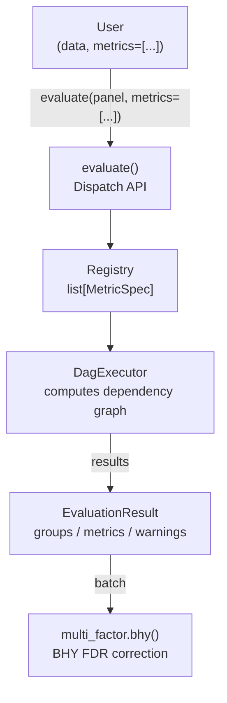

Current-state snapshot of the public API surface and internal layout.

---

## Positioning

**factrix is a Factor FactorDensity Validator, not a backtest engine.**

The library produces a single canonical p-value (`MetricResult.p_value`) per
factor per `(scope, density, structure)` cell from the cell's Newey-West (NW) heteroskedasticity-and-autocorrelation-consistent (HAC)-corrected
mainstream metric (information coefficient (IC) / FM-λ / CAAR / TS-β). Realistic execution simulation,
tradability proxies, and portfolio construction are out of scope — feed
screened factors into Zipline / Backtrader / `vectorbt` downstream.

---

## Global architecture



The dispatch runs through a Directed Acyclic Graph (DAG) executor on a closed `list[MetricSpec]` rather than a registry-keyed procedure table.

---

## Public API surface

Entry points, all in `factrix.__init__`:

| Symbol | Purpose |
|--------|---------|
| `fx.evaluate(panel, metrics=...)` | Dispatch to the metrics applicable to the factor's cell |
| `fx.multi_factor.bhy(results, *, metrics, expand_over=(), q=0.05)` | Benjamini-Hochberg-Yekutieli (BHY) false discovery rate (FDR) correction; one declared family per call (optionally split per-bucket via `expand_over`) |

Plus introspection / error / enum re-exports:

- `fx.FactorScope`, `fx.FactorDensity` — user-facing axes
- `fx.WarningCode` — structured result codes
- `fx.FactrixError`, `fx.IncompatibleAxisError`, `fx.InsufficientSampleError`, `fx.UserInputError` — exception hierarchy (see § Error UX contract)

`__version__` is sourced from `pyproject.toml` (Commitizen-managed).

---

## DataStructure — the derived fourth axis

The three user-facing axes (`FactorScope`, `FactorDensity`, `Metric`) are the SSOT;
see [Concepts § Three orthogonal design axes](../getting-started/concepts.md#three-orthogonal-design-axes)
for their values and orthogonality.

`DataStructure` is the fourth axis but is **not user-facing** — it is derived at
evaluate-time from `panel["asset_id"].n_unique()` (`factrix._detect_structure`):
`PANEL` for `N ≥ 2`, `TIMESERIES` for `N = 1`. Each `MetricSpec` declares the
`(scope, density, structure)` cell it applies to (`None` on an axis = `*`
wildcard); the DAG executor derives the runtime structure and dispatches each
requested metric against its cell. A metric inapplicable to the data's cell
raises under `strict=True` or short-circuits to a NaN `MetricResult` under
`strict=False`. There is no separate routing token and no scope-collapse step
(see § PANEL / TIMESERIES equivalence).

---

## MetricSpec SSOT dispatch

Each `factrix/metrics/*.py` module decorates its public callables with
`@metric` — **the** source of truth, resolved through `factrix._metric_index`:

- `MetricSpec(name, cell, aggregation, ...)` — the typed
  per-callable spec; `cell` is a `(scope, density, structure)` `Cell` with `None`
  = `*` wildcard on any axis.
- `spec_by_name() -> dict[str, MetricSpec]` — name → spec lookup across every
  registered metric.
- `public_specs()` — visibility-filtered specs (drops `PIPELINE`-role stage-1
  helpers pulled only via `requires`).
- `list_metrics()` — the public runtime discovery API, grouped by cell.

`@metric`-class registration feeds the index via
`factrix.metrics._registry.register`. Every introspection / validation path
reads this index — no parallel rule table.

Adding a metric decorates one callable with `@metric`; the DAG executor picks
it up by cell match.

---

## EvaluationResult dataclass contract

`factrix/_results.py`:

```python
@dataclass(frozen=True, slots=True)
class EvaluationResult:
    factor: str
    cell: tuple[FactorScope, FactorDensity, DataStructure]
    forward_periods: int
    n_periods: int
    n_pairs: int
    n_assets: int
    metrics: Mapping[str, MetricResult]
    plan: str
    context: Mapping[str, Any] = field(default_factory=dict)
    warnings: list[Warning] = field(default_factory=list)
```

One unified `EvaluationResult` is returned by `evaluate` — no per-cell subclass.
It replaces the pre-v0.14 `FactorProfile` (inferential) / `MetricsBundle`
(descriptive) split. Dispatch runs through the DAG executor
(`factrix._dag.DagExecutor`) on a closed `list[MetricSpec]`.

- `cell` is the `(scope, density, structure)` tuple of the dispatched cell.
- Per-metric outputs live in `metrics`, a read-only `Mapping[str, MetricResult]`
  (`MappingProxyType`) mapping each label to its `MetricResult`. Screening verbs read each result's
  `MetricResult.p_value` — by convention the mainstream metric's.
- Advisory diagnostics are a flat `list[Warning]` on `warnings` — per-metric
  records carry `source=<metric name>`, bundle / pre-dispatch records carry
  `source=None`.
- `plan` is the DAG executor's numbered topological execution plan.
- `to_frame()` / `to_dict()` are the serialisation exit points.

---

## PANEL / TIMESERIES equivalence

Both structures produce real `MetricResult.p_value` values — neither is degraded.

`(INDIVIDUAL, DENSE, *) × N=1` is mathematically undefined (no
cross-sectional dispersion → IC and per-date ordinary least squares (OLS) undefined). The IC / FM
specs declare `cell.structure = PANEL`, so under `strict=True` evaluate raises
`IncompatibleAxisError`; under `strict=False` the metric short-circuits to a NaN
`MetricResult` with a `reason`. Explicit and user-correctable, never a silent rewrite.

`(*, SPARSE, *) × N=1` is well-defined and runs with **no scope-collapse step**.
The sparse metrics' cells apply at `N=1`, so the DAG executor runs them directly
on the single-asset series — scope-collapse no longer happens, and there is no
sentinel routing both sparse scopes to a shared TIMESERIES procedure. At `N=1`
the `INDIVIDUAL` / `COMMON` distinction is moot (one asset → no
scope axis), but that falls out of the derived structure rather than an explicit
routing token.

---

## Sample guards

User-facing tier semantics (hard block / soft warning / clean) live in
[Guides § Panel vs timeseries — Sample guards](../guides/panel-timeseries.md#sample-guards).
This section catalogues the **internal constants** that back those tiers.

### Naming grammar

Every sample-size identifier — runtime count, declarative floor, calibrated
constant, warning code, drop-stat key — is named off a single **axis token**
so a reader resolves *which axis* a name guards from the name alone. New
identifiers must use an axis token, with two deliberate registers/exceptions:

- **Two registers for the time axis.** The *data layer* speaks the panel
  column token `date` (`n_dates` = distinct dates, grounded in
  `adapt(date="date")`); the *stats layer* speaks the axis token `periods`
  (`n_periods`, `MIN_PERIODS_*`, `min_periods`). Same dimension, two registers
  — a count of the raw column vs the abstract series length.
- **The cross-metric neutral `n_obs`.** `MetricResult.n_obs` (a first-class
  serialized field) and the generic `fx.inference` estimators carry an
  axis-agnostic `n_obs` on purpose: at those layers the caller's axis is
  unknown and any single token would mislabel a pooled or estimator-specific
  count. Per-metric metadata keys still use an axis token.
- **`groups` is not a sample axis.** The quantile-bucket count `n_groups`
  (quantile spread, monotonicity) is a *partition parameter the caller
  chooses*, not an observed sample dimension: below its target it is
  silently downscaled to fit the cross-section (`_downscale_n_groups` in
  `factrix/_stats/slice_policy.py`), never blocked or warned like a thin
  `n_periods`. So it carries no `SampleThreshold` tier and stays out of
  `_AXES` (which is the four genuine sample axes above). Its per-bucket
  floor is `min_assets_per_group` — an `assets`-axis quantity scoped per
  bucket, already within the grammar, not a fifth axis.

| Axis token | Dimension |
|------------|-----------|
| `periods`  | time-series length (T; number of dates / draws) |
| `assets`   | cross-sectional asset count (N per date) |
| `pairs`    | complete `(factor, return)` pairs (FM cross-section) |
| `events`   | event-date count |

Four layers, one grammar:

- **Runtime counts** — `n_<axis>`: `n_periods`, `n_assets`, `n_events`,
  `n_pairs`. Drop accounting adds the directional/derived forms
  `n_<axis>_in`, `n_<axis>_out`, `dropped_<axis>`.
- **Per-metric declarative floors** (`SampleThreshold`, `factrix/_metric_index.py`) —
  `min_<axis>` / `warn_<axis>` fields (`min_periods`/`warn_periods`, …). A metric
  is *unusable* below `min`, *degraded* in `[min, warn)`, *clean* at `≥ warn`;
  `__post_init__` enforces the `min <= warn` invariant. Axes a metric does not
  use are left `None`.
- **Calibrated module constants** (SSOT for the literals) —
  `MIN_[<DOMAIN>_]<AXIS>[_<TIER>]`. The `AXIS` token is mandatory
  (`PERIODS`/`ASSETS`/`EVENTS`/`PAIRS`); `DOMAIN` is an optional prefix qualifier
  (`BROADCAST`, `PORTFOLIO`, `FM`, `IC`) that disambiguates when the *same*
  axis is gated by a *different* statistic — e.g. CAAR's `MIN_EVENTS_HARD` vs
  the broadcast-dummy `MIN_BROADCAST_EVENTS_HARD`. `TIER` is `_HARD`
  (raise / short-circuit floor) or `_WARN` (degrade floor). **`_HARD` is
  dropped on any axis that never raises** — `MIN_ASSETS_WARN` carries no
  `_HARD` because the cross-asset t-test is defined for `n_assets ≥ 2`
  (only weak, never undefined), so a single warn floor flags the whole thin
  regime and severity is read from the `n_assets` metadata. **A constant for
  one axis must never gate another** — introduce a separate `_PERIODS`
  constant even when the calibrated value coincides with an `_ASSETS` one.
- **Warning codes** (`factrix/_codes.py`) carry the same axis token so the
  degraded axis is legible from the code alone:
  `UNRELIABLE_SE_SHORT_PERIODS`, `FEW_EVENTS`, `FEW_ASSETS`,
  `BORDERLINE_PORTFOLIO_PERIODS`, `SPARSE_COMMON_FEW_EVENTS`, and the
  axis-specific drop pair `EXCESSIVE_PERIOD_DROPS` / `EXCESSIVE_ASSET_DROPS`.

Silent-drop diagnostics emit a fixed per-axis metadata schema
(`factrix/metrics/_helpers.py`): `n_<axis>_in`, `n_<axis>_out`,
`dropped_<axis>`, `drop_rate`, `drop_rate_threshold` — the count keys carry the
axis token, the rate keys are axis-neutral.

### Backing constants

`factrix/_stats/constants.py`:

- `MIN_PERIODS_HARD = 20`, `MIN_PERIODS_WARN = 30` — the two-tier `n_periods` thresholds.
- `MIN_ASSETS_WARN = 30` — the single `n_assets` warn floor (no `_HARD` tier). The
  `n_assets` axis never raises (cross-asset t-test on E[β] is mathematically defined for
  `n_assets ≥ 2`), so constant naming deliberately drops the `_HARD` suffix to avoid
  implying a raise.
- `auto_bartlett(T) = max(1, int(4 * (T/100)**(2/9)))` — Newey-West (1994) auto lag rule.
- Hansen-Hodrick (1980) overlap floor: `max(auto_bartlett(T), forward_periods - 1)` —
  ensures NW lag covers MA(h-1) structure from overlapping forward returns.

`factrix/_types.py` and the metric primitives keep the older per-metric thresholds used
internally by the primitives that procedures wrap:

- `MIN_IC_ASSETS = 10` — `compute_ic` drops dates with fewer than 10 assets;
  at `n_assets` < 10 the IC procedure short-circuits to NaN because every date is dropped.
- `MIN_EVENTS_HARD = 4`, `MIN_EVENTS_WARN = 30` — two-tier sparse-cell
  event-count floor. `n < HARD` short-circuits the CAAR / event-quality
  primitives; `HARD ≤ n < WARN` emits `WarningCode.FEW_EVENTS`.
- `MIN_FM_ASSETS = 3` (`factrix/metrics/_primitives/_fm_betas.py`) — `compute_fm_betas`
  emits a date only with ≥ 3 complete
  `(factor, return)` pairs and non-zero cross-sectional variance; the closed-form
  slope `Cov_t(x, y) / Var_t(x)` is computed batched across factors (one
  `group_by("date").agg`), so degenerate (zero-variance) dates are dropped rather
  than assigned an arbitrary least-norm slope.

### Inflation cost at low `n_assets`

For interpreting borderline p-values when `n_assets` falls in the warning bands:
df = `n_assets` − 1 → t_crit at `n_assets` = 3 ≈ 4.30 (+119% vs asymptotic 1.96),
at 5 ≈ 2.78 (+42%), at 10 ≈ 2.26 (+15%), at 20 ≈ 2.09 (+7%). The test still
runs; the warning surfaces the inflation so callers can read p ≈ 0.04 as
"borderline at this `n_assets`" rather than "rejected".

---

## Error UX contract

User-facing raises follow a single canonical message format so callers
learn to read factrix errors once and recover programmatically across
all functions.

### Hierarchy

```
FactrixError                       # base — all factrix-raised errors
├── IncompatibleAxisError
├── InsufficientSampleError    # carries .actual_periods / .required_periods
├── UnknownEstimatorError
└── UserInputError                 # named-set typo / type mismatch
```

`UserInputError` is the marker for "user typed the wrong thing"
(unknown metric / `expand_over` key, column not in panel,
wrong type). Catch it separately from `IncompatibleAxisError` (axis miswire) and
`InsufficientSampleError` (data limitation) when those branches need
different recovery.

### Three required fields

Every user-facing raise that takes a named input must carry:

1. **Trigger**: the kwarg / column name and the value received
2. **Diagnostic**: either fuzzy candidates (named-set error) or an
   expected-shape string (type error)
3. **Docs link**: deployed-docs anchor for the function

### Constructor

`UserInputError` is keyword-only and renders its own message:

```python
UserInputError(
    *,
    func_name: str,
    field: str,
    value: object,
    candidates: Iterable[object] | None = None,   # named-set typo
    expected: str | None = None,                  # type / shape mismatch
    docs_path: str,                               # "api/<func_name>#<anchor>"
)
```

- Exactly one of `candidates` / `expected` carries the diagnostic.
- Fuzzy match: `difflib.get_close_matches(str(value), candidates, n=3, cutoff=0.6)`.
- Non-string candidates are coerced via `str(...)` so `Enum` members or
  type objects work without pre-conversion at the call site.
- `docs_path` is appended to `https://awwesomeman.github.io/factrix/`
  so the deployed base URL lives in one place
  (`factrix._errors._DOCS_BASE`).
- Long candidate lists truncate to the first 15 with a
  `Available (15 of N, see Docs):` header; long `value` reprs cap at
  120 chars to keep messages readable when callers pass DataFrames or
  polars expressions.
- Language: English (consistent with docstrings; errors land in
  stack traces / CI output).

### Structured attributes

Sub-issues and downstream consumers (LLM agents, screening loops)
recover via attributes, not message substrings:

- `.func_name`, `.field`, `.value`, `.expected`, `.docs_url`
- `.candidates: tuple[str, ...]` — sorted, `()` in the type-mismatch branch
- `.suggestions: tuple[str, ...]` — difflib top-3, `()` when none above cutoff

`UserInputError` multi-inherits from `ValueError` so generic ecosystem
code (`pytest.raises(ValueError)`, broad `except ValueError`) still
catches it.

### Adoption

The contract is opt-in for new user-facing raises. Each v1 function
sub-issue (#147 / #160 / #161 / #162) declares conformance in its
own acceptance criteria; retrofit of pre-contract raise sites is
tracked separately so the helper itself can land without forcing a
sweep.

---

## Procedure pipelines

The mainstream-metric pipelines differ in **aggregation order** — which axis is
collapsed first determines small-sample failure modes and the N=1 behaviour. The
cell a factor dispatches to determines which pipeline runs.

The two universal `n_periods` floors apply to every panel/timeseries pipeline
listed below — `n_periods < MIN_PERIODS_HARD` raises `InsufficientSampleError`,
`MIN_PERIODS_HARD ≤ n_periods < MIN_PERIODS_WARN` emits
`UNRELIABLE_SE_SHORT_PERIODS`. The per-procedure "Failure modes" lists below
record only the **procedure-specific** failures; for the user-facing tier
matrix see [Guides § Panel vs timeseries](../guides/panel-timeseries.md). For
the trigger / meaning of every code emitted below see the
[`WarningCode` table](../reference/warning-codes.md#warningcode).

### Terminology — aggregation regime

Two regimes, each with concrete sub-forms. Pipeline pseudocode tags each
step with `(cross-section step)` or `(time-series step)` inline:

- **cross-section step** — aggregate over assets at a fixed date
  - `per-date` — applied to every date (continuous panel)
  - `per-event-date` — restricted to dates where `factor != 0` (sparse cells)
- **time-series step** — aggregate over the time axis
  - `per-asset` — fix one asset, aggregate its full date sequence
    (`filter(asset_id == X)`)
  - on a previously-built time-indexed series — e.g. NW HAC t-test on
    `IC[t]` or `β[i]` after the upstream step has produced the series

Unqualified `per-event` is **not** used — always written as `per-event-date`
to keep the regime unambiguous.

### Inference selection (`inference=`)

Only the series-mean family (`ic`, `quantile_spread`, `k_spread`) takes a
selectable `inference=`; every other metric carries a fixed estimator by
its statistical shape, so the absence of the knob is by design. The
`factrix.inference` module docstring is the SSOT for the full rule — the
per-family rationale, the closed-union policy, and why `HANSEN_HODRICK` is
exported yet absent from the metric unions.

### `individual_continuous(IC)` — cross-section first

```
per-date Spearman across n_assets         (cross-section step)
                                       →  n_periods-length IC time series
                                       →  NW HAC t-test on mean(IC)        (time-series step)
```

Failure modes:

- `n_assets` < 10 → `MIN_IC_ASSETS` drops every date → output is NaN.

### `individual_continuous(FM)` — cross-section first

```
per-date OLS R = α + β·FactorDensity across n_assets   (cross-section step)
                                              →  n_periods-length λ time series
                                              →  NW HAC t-test on mean(λ)   (time-series step)
```

Failure modes:

- per-date `n_assets` < 3 → date dropped (`if len(y) < 3: continue`).
- per-date `n_assets` small but ≥ 3 → df = `n_assets` − 2 minimal, β unstable.
- `n_periods < MIN_FM_PERIODS_HARD = 4` → short-circuit to insufficient
  (math floor — NW HAC `t` undefined below).
- `MIN_FM_PERIODS_HARD ≤ n_periods < MIN_FM_PERIODS_WARN = 30` → returns
  the FM `t`/`p` but emits `WarningCode.UNRELIABLE_SE_SHORT_PERIODS` and
  the borderline propagates into `EvaluationResult.warnings`.

### `individual_sparse` (CAAR PANEL) — cross-section first (events)

```
per-event-date mean of signed_car = return × factor      (cross-section step)
                                                       →  event-date-indexed CAAR
reindex to dense period grid, zero-fill non-event periods   →  n_periods-length CAAR series
                                                       →  NW HAC t-test on mean(CAAR)   (time-series step)
```

The CAAR series is **period-grid-indexed**: `compute_caar` produces an
event-date-indexed primitive (filter `factor != 0`), which the procedure
then reindexes against the full panel period set with zero-fill. This is
the calendar-time portfolio approach (Jaffe 1974, Mandelker 1974; Fama
1998 §2) — restores the lag rule's "consecutive observations are 1
period apart" assumption that an event-only series would otherwise
break. With it, sparse events let zero-padding zero out spurious
autocovariance terms and clustered events get the real MA(h-1) overlap
weighted correctly. Pipeline parity with IC / FM / common-sparse PANEL.

Magnitude is preserved as a weight in `signed_car` (no `.sign()` coercion
at this layer — `compute_caar`'s docstring carries the input-form
behaviour table). User-facing `MEAN` reports the per-event-date
mean (the average effect on event days); `n_obs` reflects the dense
series the t-stat is computed on.

Failure modes:

- `n_events < MIN_EVENTS_HARD = 4` → event series too short →
  short-circuits to a NaN `MetricResult` (`p_value` conservatively `1.0`).
- `MIN_EVENTS_HARD ≤ n_events < MIN_EVENTS_WARN = 30` → CAAR `t` is
  returned but `WarningCode.FEW_EVENTS` fires; the `caar` metric attaches it
  to `MetricResult.warning_codes` and the DAG executor lifts it into
  `EvaluationResult.warnings`.

### `common_continuous` — time-series first

```
per-asset OLS R_i = α_i + β_i·F over all n_periods dates   (time-series step)
                                                         →  n_assets-length β vector
                                                         →  cross-asset t-test on E[β]   (cross-section step)
```

Failure modes:

- per-asset `n_periods < MIN_TS_OBS = 20` → asset dropped.
- `n_assets < MIN_ASSETS_WARN = 30` → `WarningCode.FEW_ASSETS` (still runs; severity scales with `n_assets`).
- `n_assets = 1` → no asset cross-section to aggregate the per-asset βs
  over. The cell declares `cell.structure = PANEL`, so `evaluate` raises
  `IncompatibleAxisError` under `strict=True` (NaN + `structure_mismatch`
  under `strict=False`); there is no single-series β fallback. See
  §PANEL/TIMESERIES equivalence.

### `common_sparse` (PANEL) — time-series first

```
per-asset OLS R_i = α_i + β_i·D over all n_periods dates   (time-series step)
                                                         →  n_assets-length β vector
                                                         →  cross-asset t-test on E[β]   (cross-section step)
```

Same shape as `common_continuous`; the broadcast `D` carries the
sparse `{0, R}` schema (`R` is unrestricted; `{0, 1}` for a pure
event flag is the simplest form) and replaces the continuous
regressor. Factor magnitudes are **preserved** in
the OLS (no `.sign()` coercion at this layer — distinct from the
`individual_sparse` PANEL pipeline). Augmented Dickey-Fuller (ADF) persistence diagnostic is skipped
per I6 (sparse regressors are not unit-root candidates).

Failure modes:

- per-asset `n_periods < MIN_TS_OBS = 20` → asset dropped.
- `n_assets` cross-section guard same as `common_continuous` (single
  `FEW_ASSETS`; severity from `n_assets` metadata).
- Two-tier event-count guard (`factrix/_stats/constants.py`):
  `n_events < MIN_BROADCAST_EVENTS_HARD = 5` raises `InsufficientSampleError`;
  `5 ≤ n_events < MIN_BROADCAST_EVENTS_WARN = 20` emits
  `SPARSE_COMMON_FEW_EVENTS`.
- Cross-asset SE assumes asset-level independence; under contemporaneous
  return correlation the standard t over-states significance — Petersen
  (2009) clustered SE deferred.

### `common_continuous` at N=1 — not supported

`common_continuous` metrics (`ts_beta`, `ts_quantile`, `ts_asymmetry`)
test the **cross-asset** distribution of per-asset βs, so they require
`N ≥ 2`. At `N = 1` the cell (`COMMON, DENSE, PANEL`) does not match the
derived `TIMESERIES` structure, so `evaluate` raises
`IncompatibleAxisError` (or NaN + `structure_mismatch` under
`strict=False`). There is **no** single-series β collapse — for
single-asset time-series inference use `ic(inference=fx.inference.NEWEY_WEST)`
(Individual × Continuous) or the scope-agnostic TIMESERIES metrics
(`hit_rate`, `oos_decay`, `ic_trend`, `directional_hit_rate`).

### `(*, SPARSE, *) × N=1` (TS dummy) — time-series only

```
single-asset OLS y_t = α + β·D_t + ε on period-dense series   (time-series step)
                                                              →  NW HAC t-test on β
                                                              +  Ljung-Box on residual
                                                              +  event_temporal_hhi
                                                              +  event-window-overlap check
```

Reached whenever a sparse factor evaluates at N=1 — the sparse metrics' cells
apply at TIMESERIES, so the DAG executor runs them directly on the single-asset
series (no scope-collapse step; at N=1 the two scopes are statistically
equivalent). The series is the **full period grid** with
zero-padding on non-event periods (distinct from the PANEL CAAR computation,
which works on the event-date-only series). Factor magnitudes are
preserved (no `.sign()` coercion at this layer).

Failure modes:

- Ljung-Box p < 0.05 on residuals → `WarningCode.SERIAL_CORRELATION_DETECTED`.
- Consecutive event gap < 2·`forward_periods` → `WarningCode.EVENT_WINDOW_OVERLAP`.

---

## Family functions and the resolution layer

Multiple-testing functions (`bhy` today; `bhy_hierarchical` / `partial_conjunction` /
`bonferroni` / `holm` / `romano_wolf` planned) share a single internal pre-processing
layer in `factrix/_family.py::_resolve_family`. Each function's procedure runs *after*
the family-resolution invariants pass.

### Two signature classes

The shared layer admits two function shapes — important to keep distinct so a
resampling-based function cannot retroactively force a kwarg onto the closed-form
ones:

| Class | Functions | Signature shape |
|-------|-------|-----------------|
| Closed-form (p-value only) | `bhy` / `bhy_hierarchical` / `partial_conjunction` / `bonferroni` / `holm` | `(profiles, *, metrics, expand_over, ...)` |
| Resampling-based | `romano_wolf` (planned) | `(profiles, panel, *, metrics, expand_over, n_bootstrap, ...)` — needs raw return panel for bootstrap step-down |

### `_resolve_family` four invariants

For input `profiles: Sequence[EvaluationResult]`, `expand_over: Sequence[str] | None`,
and `metric: str` (one resolved spec):

1. `expand_over` names must be present in every profile's `context` and must
   not collide with identity dimensions (`factor_id` / `forward_periods`) —
   identity names *the hypothesis*, context names *the slicing condition*;
   confusing the two is the v0.5 anti-shopping defense at the family layer.
2. partition key per profile = `identity + tuple(context[k] for k in expand_over)`
   must be unique across the input. `EvaluationResult.__hash__ = None`, so dedup
   walks the tuple, not a hash.
3. The specified `metric` must have a computed `p_value` that is non-NaN,
   and must be populated on every profile.
4. Resolved `p_value` per entry: the p-value read from the specified `metric`.

All three user-facing raises route through `factrix._errors.UserInputError`
so fuzzy suggestions and docs links render uniformly.

### `expand_over` semantics

`expand_over` declares per-bucket independent families (Benjamini & Bogomolov
2014, *Selective Inference on Multiple Families of Hypotheses*, JRSS-B). Each
unique tuple of `context[k] for k in expand_over` is its own step-up batch —
e.g. `expand_over=["regime_id"]` runs one BHY step-up per regime.

### Caller responsibilities (#161 contract change)

`bhy` previously auto-partitioned by `(cell, forward_periods)`.
#161 retired the auto-split in favour of explicit family declaration:

- Mixing cells without distinct `factor_id` now raises `UserInputError`
  (duplicate identity) where v0.4 silently auto-split. Set `factor_id` per
  candidate, or use `expand_over` if profiles legitimately share identity.
- Mixing `forward_periods` without `expand_over` emits a `RuntimeWarning` —
  different horizons carry different null distributions, and pooling them
  dilutes the per-rank threshold `q × k / N`.
- Cross-family aggregation (horizon-shopping correction) remains the
  user's responsibility — see the [BHY screening](../api/bhy.md) reference page.

---

## Mainstream metric vs supplementary metric

A documentation convention — **not** a code-enforced tier — for organising the
metrics in `factrix/metrics/*.py`. Both kinds register a `MetricSpec` via
`@metric` with the same `role=METRIC`; the distinction is editorial intent, and
`evaluate()` runs exactly the metrics the caller passes either way. Choosing
which kind to add:

| Kind | Intent | Definition | How callers reach it |
|------|--------|------------|----------------------|
| **Mainstream metric** | the headline mean-significance test for a cell | The conventional PASS/FAIL test for a `(scope, density, structure)` cell (IC / FM / CAAR / TS-β) | passed into `evaluate(metrics=...)`; its `MetricResult.p_value` is what the screening verbs read |
| **Supplementary metric** | second-look / diagnostic | **Diagnostic / second-look / multi-statistic** decomposition, surfaced alongside the mainstream metric and importable directly | the metric's `MetricResult` in `EvaluationResult.metrics`, and `from factrix.metrics import X` |

### When to add a mainstream metric

Add a mainstream metric when introducing the headline mean-significance test for
a legal cell on the axis (`FactorScope × FactorDensity × Metric × DataStructure`)
that does not have one yet. Nothing enforces one-per-cell; keeping each cell to a
single agreed default test is a convention that gives callers an obvious first
choice, not an invariant the code checks.

### When to add a supplementary metric

Everything else. Specifically:

- **Same cell already has a mainstream metric** but you want to surface a different angle
  (non-linearity, asymmetry, decomposition, regime split). Example precedent:
  `event_quality.py` (hit_rate / profit_factor / event_skewness / signal_density) all
  supplement the mainstream CAAR metric for `(*, SPARSE, PANEL)`.
- **Descriptive diagnostic without a formal H₀** (concentration Herfindahl-Hirschman index (HHI), tradability, out-of-sample (OOS) decay).
- **Multi-factor relationship** outside the single-factor inference frame (`spanning.py`).

### Supplementary metric contract

- Take `pl.DataFrame` with the cell's standard schema (`date, asset_id, factor, forward_return`)
  plus any optional columns
- Return `MetricResult` (`factrix/_results.py`) — `name`, `value`, optional `p_value`,
  `n_obs`, `stat`, `warning_codes`, and a `metadata` dict for cell-specific scalars
- Use `_short_circuit_output(...)` for sample-floor failures rather than raising
- Reuse `_stats/` primitives (`_p_value_from_t`, `_calc_t_stat`, NW HAC helpers) so the
  statistical treatment matches the mainstream metrics — most notably **NW HAC SE
  for any inference on overlapping forward returns**, never iid Welch / OLS SE

A supplementary metric's p-value carries no special status over the mainstream
metric's; when run standalone (`from factrix.metrics import X`) outside
`evaluate`, the user is responsible for collecting comparable p-values into a
family themselves if FDR control is needed across a batch.

---

## Module layout

```
factrix/
├── __init__.py              # public surface + evaluate()
├── _axis.py                 # FactorScope / FactorDensity / DataStructure / Tier + spec-metadata
│                            #   enums (Aggregation / SpecRole / InputShape / OutputShape)
├── _codes.py                # WarningCode StrEnum
├── _errors.py               # flat hierarchy: FactrixError → {IncompatibleAxisError, InsufficientSampleError, UnknownEstimatorError, UserInputError}
├── _metric_index.py         # MetricSpec + @metric-registry SSOT (spec_by_name / list_metrics / public_specs / metric_spec)
├── _dag.py                  # DagExecutor — MetricSpec.requires / batchable dispatch (+ CycleError)
├── _results.py              # EvaluationResult / MetricResult / Warning dataclasses
├── _inspect.py              # inspect_data — typed data introspection with per-metric verdict
├── _compare.py              # compare — multi-metric leaderboard over EvaluationResult lists
├── _family.py               # _resolve_family — shared family resolution for the FDR verbs
├── _multi_factor.py         # bhy / partial_conjunction / bhy_hierarchical impls
├── multi_factor.py          # public namespace (re-exports the FDR verbs)
├── _data_input.py           # input-type gateway for public entry points
├── adapt.py                 # column-name adapter → factrix canonical names
├── _logging.py              # shared loggers
├── _ols.py                  # shared OLS helpers (spanning metrics + orthogonalize preprocess)
├── _types.py                # shared constants: EPSILON, DDOF, MIN_IC_ASSETS,
│                            #   MIN_EVENTS_HARD/WARN, MIN_OOS_PERIODS, MIN_PORTFOLIO_PERIODS_HARD/WARN, ...
├── _stats/                  # numerics: hac, bootstrap, unit_root, wald, gmm, ols, diagnostics, constants
├── stats/                   # public estimator surface (newey_west, hansen_hodrick, driscoll_kraay, gmm, ...)
├── estimators/              # lowercase estimator callables
├── metrics/                 # @metric callables (ic, fm_beta, ts_beta, caar, ...) + _registry
│                            # per-cell thresholds (MIN_FM_PERIODS_HARD/WARN, MIN_TS_OBS) live
│                            # alongside the metrics that enforce them
├── slicing/                 # by_slice + slice_pairwise_test / slice_joint_test
├── preprocess/              # compute_forward_return / normalize / orthogonalize
└── datasets.py              # synthetic CS / event panels
```

---

## Invariants

Hard constraints — violating these breaks the API contract:

1. `MetricSpec` is `frozen=True, slots=True`; every construction path runs `__post_init__`, which enforces the field invariants (e.g. `role=METRIC → output_shape=SCALAR`).
2. All result dataclasses — `EvaluationResult`, `MetricResult`, `Warning` — are `frozen=True, slots=True`; `EvaluationResult.metrics` is a `MappingProxyType` for read-only per-metric outputs. One unified `EvaluationResult` — no per-cell subclass.
3. The metric-spec SSOT is the `@metric` registration in each `factrix/metrics/*.py`, resolved through `factrix._metric_index` (`spec_by_name` / `public_specs` / `list_metrics`); no parallel rule table. `@metric`-class registration feeds the index via `factrix.metrics._registry.register`.
4. The DAG executor is the single dispatch path. `DagExecutor` topologically orders specs by `MetricSpec.requires` (raising `CycleError` on cycles), runs `batchable=True` producers once per factor batch and `batchable=False` consumers once per factor, and short-circuits a downstream consumer with a NaN `MetricResult` + `WarningCode.UPSTREAM_UNAVAILABLE` rather than invoking it on missing upstream data.
5. `MetricResult.p_value` is the single canonical p-value read path — `EvaluationResult.to_frame()` / `to_dict()`, `compare`, and the BHY family resolver all read it; the p-value lives only on the field and is not duplicated into `metadata`. `warnings` flag interpretation risk but never rebind it.
6. Family declaration is explicit: a screening verb's input list is one family, optionally split per bucket via `expand_over`. `_resolve_family` enforces (a) the hypothesis identity `(factor, *expand_over_values)` is unique across the input, (b) `expand_over` names come only from `EvaluationResult.context` (or the built-in `forward_periods`), never the factor, (c) `p_value` is populated everywhere before procedures read it. Cell / horizon partitioning is the caller's responsibility; mixed `forward_periods` without `expand_over` warns.
7. `T < MIN_PERIODS_HARD` raises `InsufficientSampleError`; metrics never silently produce a result on under-sampled data. NW HAC lag selection on overlapping forward returns floors at `forward_periods - 1` (the Hansen-Hodrick floor) so serial correlation from overlap is not under-counted.

For the user-facing field walk of `EvaluationResult` (and its
`metrics` mapping), see
[Reading results](../guides/reading-results.md). The `MetricResult.p_value`
contract above is what that page links back to.

---

## Testing

`tests/` covers the current public surface only — historical pre-v0.5 tests
were removed in the §8.2 deletion sweep. Fixtures are fully synthetic
(`tests/conftest.py` + `factrix.datasets`); no test reads real market data
from disk.

Run: `uv run pytest`

### Docs SSOT strategy — docstring tags drive the matrix

`docs/reference/metric-pipelines.md` no longer contains a hand-written
matrix. The matrix is generated at build time from machine-readable
`Matrix-row:` tags embedded in each `factrix/metrics/*.py` module docstring.

**How it works:**

- Each public metric module carries one or more `Matrix-row:` lines at the
  end of its module-level docstring, with five pipe-separated fields:
  `public_functions | cell_scope | aggregation_order | inference_se | primitives`.
- `scripts/mkdocs_hooks/gen_metric_matrix.py` (a MkDocs `hooks:` entry) parses every
  public module with `ast`, extracts the tags, and writes
  `docs/reference/_generated_metric_matrix.md` before each docs build.
- `metric-pipelines.md` includes the generated file via
  `--8<-- "docs/reference/_generated_metric_matrix.md"` (pymdownx.snippets).

**CI coverage (`tests/test_docs_matrix.py`):**

- Every public metric module has at least one `Matrix-row:` tag.
- Every tag has exactly 5 pipe-separated fields.
- `_generated_metric_matrix.md` exists and is non-empty (skipped if absent,
  so CI that only runs pytest without a prior build does not false-positive).

**Why docstring tags rather than a pure CI presence guard:** a guard
that only checks presence/absence of module references leaves drift in
the five data columns (scope, aggregation order, inference SE,
primitives) invisible to CI. Making the docstring the single source of
truth for all six matrix columns closes that gap — adding a module
without a `Matrix-row:` tag fails the test, and editing the tag
automatically updates the rendered docs on the next build.
