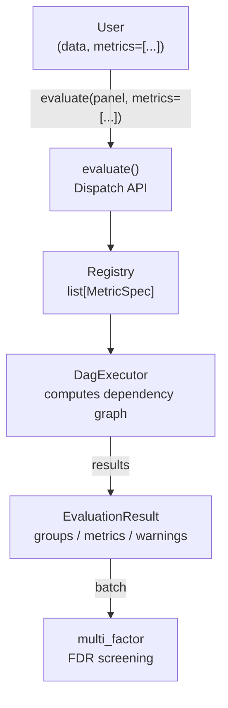

Current-state reference for internal contracts, dispatch, and module layout.
Use it as a lookup page rather than a start-to-finish guide. User-facing scope
lives in [Where factrix fits](../where-factrix-fits.md); callable details live
in the [API reference](../api/index.md).

---

## Positioning

factrix is a factor-inference and screening library, not a backtest engine.
Each metric keeps its estimate, tested tail, p-value, metadata, and warnings
explicit; downstream portfolio and execution state stays outside the package.

---

## Period grid, not calendar

**factrix never reads the calendar.** This is a first-order design principle,
not an implementation detail, and every other page that mentions frequency
links here.

- `date` is an ordering and alignment key. Its granularity — minutes, days,
  weeks, months — is never inspected; a `Date` or `Datetime` dtype is required
  only so ordering is unambiguous.
- Every horizon, window, lag, stride and sample floor is a **count of periods
  on the panel's own grid** — the distinct sorted `date` values present in the
  panel — never calendar time and never row position within an asset.
  `forward_periods=5` is five periods of whatever one row represents.
- There is no annualisation factor, no trading-day constant, no
  business-day calendar and no date arithmetic anywhere in the library.
- The evaluation grid may be spaced unevenly in periods (a caller-chosen
  rebalance grid on a finer price grid). Nothing assumes a constant stride;
  quantities that depend on spacing (overlap, non-overlapping stride) are
  derived from period indices, never from dates.
- Which real-world cadence a period represents, and aligning the factor and
  price sources onto one grid, is the caller's responsibility
  ([Preparing data §5](../guides/preparing-data.md#5-frequency-alignment-is-the-callers-job)).

**Ragged panels and the row/period distinction.** A rolling window or a shift
in polars counts *rows within a frame*; on a panel whose assets all carry every
period the two coincide, and on a ragged one — an asset missing periods the
other names have — they do not. The event family therefore reindexes onto the
panel grid before any window is taken: each asset is laid onto the full set of
distinct dates, an absent period becoming a null row rather than no row, so an
`estimation_window` of 30 spans exactly 30 grid periods for every asset and the
missing periods inside it count as missing observations instead of pulling
older periods in to fill the window. The same rule governs the event offsets in
`compute_event_returns`: `k` periods after the event is `k` steps on the grid,
and an offset landing on a period the asset does not have has no return, rather
than silently reaching further out. A dense panel is unaffected — the reindex
is a no-op there — and an asset short of periods raises
`WarningCode.RAGGED_PERIOD_GRID`, because the window still spans the requested
periods but rests on a smaller sample than the other names'.

**Wording rule.** Documentation, docstrings, warning messages and code
comments say *periods*. They do not say days, trading days, weeks,
month-ends or any other calendar unit, and examples that need a concrete
cadence say so explicitly ("on a daily panel, five periods is five days")
rather than baking it into the contract. A reviewer who finds calendar
vocabulary in a contract-level statement should treat it as a defect.

---

## Global architecture


```mermaid
flowchart TD
    User["User<br/>(data, metrics=[...])"]
    EVAL["evaluate()<br/>Dispatch API"]
    REG["Registry<br/>list[MetricSpec]"]
    DAG["DagExecutor<br/>computes dependency graph"]
    ER["EvaluationResult<br/>groups / metrics / warnings"]
    SCREEN["multi_factor<br/>FDR screening"]

    User -->|"evaluate(panel, metrics=[...])"| EVAL
    EVAL --> REG
    REG --> DAG
    DAG -->|"results"| ER
    ER -->|"batch"| SCREEN
```

The dispatch runs through a Directed Acyclic Graph (DAG) executor on a closed `list[MetricSpec]` rather than a registry-keyed procedure table.

---

## Public API surface

The public surface has four layers:

1. `evaluate` and `evaluate_horizons` build factor results.
2. `by_slice`, slice tests, and `compare` inspect or contrast those results.
3. `multi_factor` procedures apply declared-family FDR and partial-conjunction
   rules.
4. Result dataclasses, enums, errors, and discovery helpers expose the stable
   contracts used by all three layers.

The [API reference](../api/index.md) is the source for current signatures and
the complete entry-point list. `__version__` is sourced from
`pyproject.toml` and managed by Commitizen.

---

## DataStructure — the derived fourth axis

The user-facing axes `FactorScope` and `FactorDensity`, together with the metric
selection itself, are the SSOT;
see [Concepts § Three orthogonal design axes](../getting-started/concepts.md#three-orthogonal-design-axes)
for their values and orthogonality.

`DataStructure` is the fourth axis but is **not user-facing** — it is derived at
evaluate-time from `panel["asset_id"].n_unique()` (`factrix._detect_structure`):
`PANEL` for `n_assets >= 2`, `TIMESERIES` for `n_assets == 1`. Each `MetricSpec` declares the
`(scope, density, structure)` cell it applies to (`None` on an axis = `*`
wildcard); the DAG executor derives the runtime structure and normally
dispatches each requested metric by cell match. A metric inapplicable to the data's
**factor cell** (scope / density / data structure axes) raises under `strict=True` or
short-circuits to a NaN `MetricResult` under `strict=False`. A
`not_applicable*` **type-routing verdict** — the metric's signal *type* does not
fit the factor (e.g. a continuous-magnitude metric on a discrete ±k signal), a
separate axis from the cell — is soft even under `strict=True` (see § Error UX
contract → `strict` and applicability). There is no separate routing token and
no scope-collapse step (see § PANEL / TIMESERIES equivalence).

---

## MetricSpec SSOT dispatch

Each `factrix/metrics/*.py` module decorates its public callables with
`@metric` — **the** source of truth, resolved through `factrix._metric_index`:

- `MetricSpec(name, cell, aggregation, ...)` — the typed
  per-callable spec; `cell` is a `(scope, density, structure)` `Cell` with `None`
  = `*` wildcard on any axis.
- `spec_by_name() -> dict[str, MetricSpec]` — name → spec lookup across every
  registered metric.
- `public_specs()` — visibility-filtered `(family, MetricSpec)` pairs (drops
  `PIPELINE`-role stage-1 helpers pulled only via `requires`). The family is
  the declaring module stem; callers that only need specs should iterate
  `for _, spec in public_specs()`.
- `list_metrics()` — the public runtime discovery API, grouped by metric family.

`@metric`-class registration feeds the index via
`factrix.metrics._registry.register`. Every introspection / validation path
reads this index — no parallel rule table.

Adding a metric decorates one callable with `@metric`; the DAG executor picks
it up by cell match.

**Explicit sparse-event override.** One narrow exception preserves the event
contract for frequent `{0, R}` signals: when a factor is detected as `DENSE`
only because its zero ratio is below the automatic sparse threshold
(`0 < sparse_ratio < 0.5`), an explicitly requested `SPARSE` metric may run if
the same `(scope, structure)` cell would otherwise match. The result's
`EvaluationResult.cell` still records the detected data cell (`DENSE`), and the
metric/result warnings include `WarningCode.FREQUENT_EVENT_SIGNAL`. This is an
explicit-call escape hatch for frequent event studies, not a discovery default:
`inspect_data().usable` excludes the warned metric and places it in
`degraded`, so bulk discovery flows do not silently cross the density axis.

---

## EvaluationResult dataclass contract

`factrix/_results.py`:

```python title="Illustrative"
@dataclass(frozen=True, slots=True)
class EvaluationResult:
    factor: str
    cell: tuple[FactorScope, FactorDensity, DataStructure]
    forward_periods: int
    overlap_periods: int
    n_periods: int
    n_pairs: int
    n_assets: int
    metrics: Mapping[str, MetricResult]
    plan: str
    params: Mapping[str, Hashable] = field(default_factory=dict)
    metadata: Mapping[str, Any] = field(default_factory=dict)
    warnings: list[Warning] = field(default_factory=list)
```

One unified `EvaluationResult` is returned by `evaluate` — no per-cell subclass.
Dispatch runs through the DAG executor
(`factrix._dag.DagExecutor`) on a closed `list[MetricSpec]`.

- `cell` is the detected factor cell `(scope, density, structure)` for this
  result group. Under the explicit sparse-event override, this remains the
  detected `DENSE` cell even though the requested sparse metric is allowed to
  run with a `FREQUENT_EVENT_SIGNAL` warning.
- Per-metric outputs live in `metrics`, a read-only `Mapping[str, MetricResult]`
  (`MappingProxyType`) mapping each label to its `MetricResult`. Screening verbs read each result's
  `MetricResult.p_value` — by convention the mainstream metric's.
- Advisory diagnostics are a flat `list[Warning]` on `warnings` — per-metric
  records carry `source=<metric name>`, bundle / pre-dispatch records carry
  `source=None`.
- `plan` is the DAG executor's numbered topological execution plan.
- `to_frame()` / `to_dict()` are the serialisation exit points.

---

## `overlap_periods`: injection order and signature defaults

`overlap_periods` is an **injected** parameter (`MetricBase._INJECTED_PARAMS`),
not a user knob: it describes the data, not the test. `MetricBase.__call__`
resolves it in a fixed order:

1. the caller's explicit `overlap_periods=` (re-validated at the boundary, so a
   standalone call rejects the same bad value `evaluate` would);
2. otherwise, for a frame input, the panel's reserved overlap stamp written by
   `compute_forward_return` (`MetricBase._stamped_overlap_periods`);
3. otherwise, the body's signature default.

So the signature default is **unreachable under `evaluate`** — that path always
injects the stamped horizon. It binds only on a standalone call against an
unstamped frame, against a non-frame input (series consumers), or against a
producer's derived frame that carries no stamp (`fm_beta`'s `beta_df`). Reading
a signature default as "the horizon this metric assumes" is therefore wrong; it
is only the fallback for an undeclared, unstamped input.

Three defaults are in use, and the difference is deliberate:

| Default | Metrics | Meaning |
|---|---|---|
| `5` (`DEFAULT_FORWARD_PERIODS`) | most metrics — `ic`, `quantile_spread`, `k_spread`, `caar`, `event_quality.*`, `predictive_beta`, … | "Assume the library's default forward horizon." It matches `compute_forward_return`'s own default, so a hand-built unstamped panel is treated the way the default pipeline would have stamped it. |
| `1` | `spanning_alpha`, `rank_turnover` | The input is non-overlapping by construction — `spanning_alpha` consumes `compute_spread_series`' already-strided output, and on `rank_turnover` the value is a *stride* fallback rather than a HAC floor. `1` means "one period, no overlap". |
| `None` | `fm_beta`, `common_quantile_spread`, `common_asymmetry` | "No horizon declared." The value flows straight into the optional-typed HAC resolvers (`_resolve_nw_lags`, `_resolve_har_lags`, `_har_dof`), which read `None` as "apply no overlap floor and no effective-dof cap". |

`None` and `1` are **numerically identical** in all three resolvers — the floor
is `max(h - 1, 0) = 0` and the dof cap is guarded by `h > 1` — so the `int` /
`int | None` split is a semantic one (undeclared vs declared-as-one), not a
behavioural one. `None` and `5` are not: the `5` default raises the bandwidth at
small `T` and always tightens the dof cap, so unifying the `None` group onto
`DEFAULT_FORWARD_PERIODS` would silently move p-values on every unstamped
standalone call. That is why the three groups are left as they are.

---

## PANEL / TIMESERIES equivalence

Both structures produce real `MetricResult.p_value` values — neither is degraded.

`(INDIVIDUAL, DENSE, *) × n_assets == 1` is mathematically undefined (no
cross-sectional dispersion → IC and per-period ordinary least squares (OLS) undefined). The IC / FM
specs declare `cell.structure = PANEL`, so under `strict=True` evaluate raises
`IncompatibleAxisError`; under `strict=False` the metric short-circuits to a NaN
`MetricResult` with a `reason`. Explicit and user-correctable, never a silent rewrite.

`(*, SPARSE, *) × n_assets == 1` is well-defined and runs with **no scope-collapse step**.
Sparse metrics whose `MetricSpec.cell.structure` is wildcarded (`None`) apply
at `n_assets == 1`, so the DAG executor runs them directly on the single-asset series —
there is no scope-collapse step, and no sentinel routing both sparse scopes to a
shared TIMESERIES procedure. At `n_assets == 1` the `INDIVIDUAL` / `COMMON` distinction is
moot (one asset — no scope axis), but that falls out of the derived structure
rather than an explicit routing token. Sparse metrics that still need an asset
cross-section, such as `clustering_hhi` (`cell.structure=PANEL`), remain
unavailable at `n_assets == 1`.

---

## Sample guards

User-facing tier semantics (hard block / soft warning / clean) live in
[Guides § Panel vs timeseries — Sample guards](../guides/panel-timeseries.md#sample-guards).
This section catalogues the **internal constants** that back those tiers.

### Naming grammar

Every sample-size identifier — runtime count, declarative floor, calibrated
constant, warning code, drop-stat key — is named off a single **axis token**
so a reader resolves *which axis* a name guards from the name alone. New
identifiers must use an axis token, with two deliberate registers/exceptions:

- **Two registers for the time axis.** The *data layer* speaks the panel
  column token `date` (`n_dates` = distinct dates, grounded in
  `adapt(date="date")`); the *stats layer* speaks the axis token `periods`
  (`n_periods`, `MIN_PERIODS_*`, `min_periods`). Same dimension, two registers
  — a count of the raw column vs the abstract series length.
- **The cross-metric neutral `n_obs`.** `MetricResult.n_obs` (a first-class
  serialized field) and the generic `fx.inference` estimators carry an
  axis-agnostic `n_obs` on purpose: at those layers the caller's axis is
  unknown and any single token would mislabel a pooled or estimator-specific
  count. Per-metric metadata keys still use an axis token.
- **`groups` is not a sample axis.** The quantile-bucket count `n_groups`
  (quantile spread, monotonicity) is a *partition parameter the caller
  chooses*, not an observed sample dimension: below its target it is
  silently downscaled to fit the cross-section (`_downscale_n_groups` in
  `factrix/_stats/slice_policy.py`), never blocked or warned like a thin
  `n_periods`. So it carries no `SampleThreshold` tier and stays out of
  `_AXES` (which is the four genuine sample axes above). Its per-bucket
  floor is `min_assets_per_group` — an `assets`-axis quantity scoped per
  bucket, already within the grammar, not a fifth axis.

| Axis token | Dimension |
|------------|-----------|
| `periods`  | time-series length (T; number of dates / draws) |
| `assets`   | cross-sectional asset count (`n_assets` per period) |
| `pairs`    | complete `(factor, return)` pairs (FM cross-section) |
| `events`   | event-period count |

Four layers, one grammar:

- **Runtime counts** — `n_<axis>`: `n_periods`, `n_assets`, `n_events`,
  `n_pairs`. Drop accounting adds the directional/derived forms
  `n_<axis>_in`, `n_<axis>_out`, `dropped_<axis>`.
- **Per-metric declarative floors** (`SampleThreshold`, `factrix/_metric_index.py`) —
  `min_<axis>` / `warn_<axis>` fields (`min_periods`/`warn_periods`, …). A metric
  is *unusable* below `min`, *degraded* in `[min, warn)`, *clean* at `≥ warn`;
  `__post_init__` enforces the `min <= warn` invariant. Axes a metric does not
  use are left `None`.
- **Calibrated module constants** (SSOT for the literals) —
  `MIN_[<DOMAIN>_]<AXIS>[_<TIER>]`. The `AXIS` token is mandatory
  (`PERIODS`/`ASSETS`/`EVENTS`/`PAIRS`); `DOMAIN` is an optional prefix qualifier
  (`PORTFOLIO`, `FM`, `IC`) that disambiguates when the *same*
  axis is gated by a *different* statistic. `TIER` is `_HARD`
  (raise / short-circuit floor) or `_WARN` (degrade floor). **`_HARD` is
  dropped on any axis that never raises** — `MIN_ASSETS_WARN` carries no
  `_HARD` because the cross-asset t-test is defined for `n_assets ≥ 2`
  (only weak, never undefined), so a single warn floor flags the whole thin
  regime and severity is read from the `n_assets` metadata. **A constant for
  one axis must never gate another** — introduce a separate `_PERIODS`
  constant even when the calibrated value coincides with an `_ASSETS` one.
- **Warning codes** (`factrix/_codes.py`) carry the same axis token so the
  degraded axis is legible from the code alone:
  `UNRELIABLE_SE_SHORT_PERIODS`, `FEW_EVENTS`, `FEW_ASSETS`,
  `BORDERLINE_PORTFOLIO_PERIODS`, and the
  axis-specific drop pair `EXCESSIVE_PERIOD_DROPS` / `EXCESSIVE_ASSET_DROPS`.

Silent-drop diagnostics emit a fixed per-axis metadata schema
(`factrix/metrics/_helpers.py`): `n_<axis>_in`, `n_<axis>_out`,
`dropped_<axis>`, `drop_rate`, `drop_reason` — the count keys carry the
axis token, the rate keys are axis-neutral.

**Where the constants live, and what enforces the grammar.** The calibrated
literals are declared once and imported everywhere: the generic TIMESERIES
floors and the HAC bandwidth rules in `factrix/_stats/constants.py`, the
per-metric domain floors (`MIN_COMMON_BETA_PERIODS_HARD`, `MIN_FM_PERIODS_*`,
`MIN_PORTFOLIO_PERIODS_*`, …) alongside their neighbours in `factrix/_types.py`.
No module re-declares one locally. `tests/test_sample_naming_lint.py` holds the
lints: FX003 on the `MIN_*` constant names, FX005 on metric metadata keys (they
must name their axis rather than use the neutral `obs` / `sample` vocabulary
reserved for `MetricResult.n_obs` and `fx.inference`), and FX006 on the two
single-sourced signature defaults `overlap_periods` / `n_groups`, which must
reference `DEFAULT_FORWARD_PERIODS` / `DEFAULT_N_GROUPS` instead of repeating
the value.

**Effective-sample single source.** The count a metric *gates* on
(`min_<axis>`), *reports* (`n_obs` / `n_<axis>`), and records in *drop-stats*
must be the one the statistic is actually *estimated* on — the complete
observations after pairwise null-drop, not the raw row count. `forward_return`
is null-clean before it reaches a metric, but factor nulls are not dropped
upstream and are normal in real research, so a cross-sectional reduction counts
the **valid `(factor, return)` cross-section per period**: `compute_fm_betas`
(`MIN_FM_ASSETS_HARD`) and `compute_ic` (`MIN_IC_ASSETS_HARD`) both gate on that
pairwise-complete count, dropping a date with many names but a factor defined
for few rather than leaking a high-variance estimate. Counting null-padded rows
would let the gate, the report, and the estimate silently disagree.

### Backing constants

User-facing `@metric` decorators must spell out `sample_threshold=...`.
Use a non-empty `SampleThreshold` when `inspect_data()` can pre-flight a
runtime sample gate; use `SampleThreshold()` when the lack of a static
panel-shape floor is deliberate. Primitive producers under
`factrix/metrics/_primitives/` may omit the decorator field because consumers
surface the user-facing threshold or drop statistics.

`factrix/_stats/constants.py`:

- `MIN_PERIODS_HARD = 20`, `MIN_PERIODS_WARN = 30` — the two-tier `n_periods` thresholds.
- `MIN_ASSETS_WARN = 30` — the single `n_assets` warn floor (no `_HARD` tier). The
  `n_assets` axis never raises (cross-asset t-test on E[β] is mathematically defined for
  `n_assets ≥ 2`), so constant naming deliberately drops the `_HARD` suffix to avoid
  implying a raise.
- `auto_bartlett(T) = max(1, int(4 * (T/100)**(2/9)))` — Newey-West (1994) auto lag rule.
- Hansen-Hodrick (1980) overlap floor: `max(auto_bartlett(T), forward_periods - 1)` —
  ensures NW lag covers MA(h-1) structure from overlapping forward returns.

`factrix/_types.py` and the metric primitives keep the per-metric thresholds used
internally by the primitives that procedures wrap:

- `MIN_IC_ASSETS_HARD = 2`, `MIN_IC_ASSETS_WARN = 10` — `compute_ic` drops
  only dates with fewer than 2 complete `(factor, return)` pairs, the true
  computability floor for a per-period Spearman IC. Dates with 2..9 complete
  pairs are retained, and IC consumers / `inspect_data` surface
  `WarningCode.FEW_ASSETS` because the cross-section is statistically thin.
- `MIN_SERIES_PERIODS_HARD = 10` — shared periods-axis floor for
  non-overlapping series diagnostics (`ic` post-stride mean test, `positive_rate`,
  and the series-mean non-overlap pre-flight). It is intentionally not
  IC-named because the same 10-draw floor applies outside IC.
- `MIN_EVENTS_HARD = 4`, `MIN_EVENTS_WARN = 30` — two-tier sparse-cell
  event-count floor. `n < HARD` short-circuits the CAAR / event-quality
  primitives; `HARD ≤ n < WARN` emits `WarningCode.FEW_EVENTS`.
- `MIN_FM_ASSETS_HARD = 3` (`factrix/metrics/_primitives/_fm_betas.py`) — `compute_fm_betas`
  emits a date only with ≥ 3 complete
  `(factor, return)` pairs and non-zero cross-sectional variance; the closed-form
  slope `Cov_t(x, y) / Var_t(x)` is computed batched across factors (one
  `group_by("date").agg`), so degenerate (zero-variance) dates are dropped rather
  than assigned an arbitrary least-norm slope.
  `MIN_FM_ASSETS_WARN = 10` preserves those computable 3..9-asset dates
  while surfacing `WarningCode.FEW_ASSETS` from FM consumers and
  `inspect_data`.

### Inflation cost at low `n_assets`

For interpreting borderline p-values when `n_assets` falls in the warning bands:
df = `n_assets` − 1 → t_crit at `n_assets` = 3 ≈ 4.30 (+119% vs asymptotic 1.96),
at 5 ≈ 2.78 (+42%), at 10 ≈ 2.26 (+15%), at 20 ≈ 2.09 (+7%). The test still
runs; the warning surfaces the inflation so callers can read p ≈ 0.04 as
"borderline at this `n_assets`" rather than "rejected".

---

## Naming: `data` (DataFrame) vs `df_*` (degrees of freedom)

`df` is ambiguous — **degrees of freedom** in a statistics context, **DataFrame**
in the polars/pandas idiom. The collision is killed by **position**, so every name
resolves to one meaning on sight:

- **`df_…` prefix → degrees of freedom.** `df_num` (numerator / restriction rank
  `K-1`), `df_denom` (denominator), `df_resid` (residual). A DoF value never goes
  unqualified.
- **`…_df` suffix → DataFrame.** A *named* frame keeps the informative idiom
  (`ic_df`, `caar_df`, `beta_df`, `common_betas_df`) — the prefix is the content, the
  `_df` says "frame". A *standalone* frame uses **`data`**, or a semantic noun where
  one reads better (`panel`, `per_period`, `factor_panel`, `subset`, `residuals`).
- **bare `df` / `_df` → banned.** The unqualified token is exactly the ambiguous
  case (could be either register), so factrix never declares a parameter, local,
  dataclass field, or dict / column key named `df` or `_df`.

The one tolerated bare `df` is the **scipy distribution kwarg**
(`sp_stats.chi2.sf(q, df=h)`, `t.sf(t, df=...)`): it is scipy's own parameter name
at the call site, not a name factrix declares, and carries no DataFrame ambiguity
inside a `dist.sf(...)` call. The positional split keeps DoF self-describing rather
than loosening to a bare `df` — the same read-it-once principle as the
[sample-axis naming grammar](#naming-grammar).

**Enforcement.** `tests/test_naming_df.py` walks every `factrix/` module with `ast`
and fails if any function parameter, assignment target, or dataclass field is named
exactly `df` or `_df` — closing the abbreviation back-flow at CI rather than relying
on review. (ruff has no built-in for an identifier-name ban; the AST guard mirrors
`tests/test_docs_matrix.py`.)

---

## Error UX contract

User-facing raises follow a single canonical message format so callers
learn to read factrix errors once and recover programmatically across
all functions.

### Hierarchy

```
FactrixError                       # base — all factrix-raised errors
├── IncompatibleAxisError
├── IncompatibleInferenceError     # inference= outside the metric's allowlist
├── InsufficientSampleError    # carries .axis / .actual / .required / .shortfalls
└── UserInputError                 # named-set typo / type mismatch
```

`UserInputError` is the marker for "user typed the wrong thing"
(unknown metric / `expand_over` key, column not in panel,
wrong type). Catch it separately from `IncompatibleAxisError` (axis miswire) and
`InsufficientSampleError` (data limitation) when those branches need
different recovery. The split at the `strict=True` boundary is mechanical:
`_enforce_strict` reads the short-circuit reason vocabulary — an
`insufficient_*` reason is a sample shortfall (`InsufficientSampleError`), a
`no_*` reason is a missing input column or config (`UserInputError`). A battery
that fails on both raises `UserInputError`, the actionable one.

### `strict` and applicability

`evaluate(strict=True)` (the default) is loud about a metric that *fits* the
data but could not produce a value, and silent-by-design about a metric whose
*type* does not fit. The split is deliberate — applicability is a first-class
output of type-routed evaluation, not a user error — so it should not be
re-collapsed into "raise on anything inapplicable":

| `metadata["reason"]` class | Meaning | `strict=True` |
|---|---|---|
| `not_applicable*` | The metric's signal *type* does not fit this factor (e.g. a continuous-magnitude metric on a discrete ±k signal). The type-routing verdict. | **soft** — NaN + `is_applicable=False`; the applicable metrics in the same call still return |
| `insufficient_*` | The metric fits but the sample is too thin | **raise** (`UserInputError`) |
| `no_*` | Missing input column / config | **raise** |
| cell mismatch | Requested metric cell (scope / density / data structure) does not match the factor's detected cell | **raise** (`IncompatibleAxisError`), except for the explicit sparse-event override described in MetricSpec SSOT dispatch |

Rationale: throwing a mixed battery at a panel and seeing which metrics apply is
the core type-routed-evaluation workflow; aborting it because one metric's type
does not fit would discard the applicable results too. The deficiency cases
(`insufficient_*` / `no_*` / structure) stay loud because there the metric *was*
the right choice and the data or call is at fault — a NaN slipping silently into
a research result is the failure mode to avoid. `strict=False` makes *every*
case soft. Implemented in `_enforce_strict` / `_is_type_routing_reason`.

### Three required fields

Every user-facing raise that takes a named input must carry:

1. **Trigger**: the kwarg / column name and the value received
2. **Diagnostic**: either fuzzy candidates (named-set error) or an
   expected-shape string (type error)
3. **Docs link**: deployed-docs anchor for the function

### Constructor

`UserInputError` is keyword-only and renders its own message:

```text
UserInputError(
    *,
    func_name: str,
    field: str,
    value: object,
    candidates: Iterable[object] | None = None,   # named-set typo
    expected: str | None = None,                  # type / shape mismatch
    docs_path: str,                               # "api/<func_name>#<anchor>"
)
```

- Exactly one of `candidates` / `expected` carries the diagnostic.
- Fuzzy match: `difflib.get_close_matches(str(value), candidates, n=3, cutoff=0.6)`.
- Non-string candidates are coerced via `str(...)` so `Enum` members or
  type objects work without pre-conversion at the call site.
- `docs_path` is appended to `https://awwesomeman.github.io/factrix/`
  so the deployed base URL lives in one place
  (`factrix._errors._DOCS_BASE`).
- Long candidate lists truncate to the first 15 with a
  `Available (15 of N, see Docs):` header; long `value` reprs cap at
  120 chars to keep messages readable when callers pass DataFrames or
  polars expressions.
- Language: English (consistent with docstrings; errors land in
  stack traces / CI output).

### Structured attributes

Sub-issues and downstream consumers (LLM agents, screening loops)
recover via attributes, not message substrings:

- `.func_name`, `.field`, `.value`, `.expected`, `.docs_url`
- `.candidates: tuple[str, ...]` — sorted, `()` in the type-mismatch branch
- `.suggestions: tuple[str, ...]` — difflib top-3, `()` when none above cutoff

`UserInputError` multi-inherits from `ValueError` so generic ecosystem
code (`pytest.raises(ValueError)`, broad `except ValueError`) still
catches it.

### Adoption

The contract is opt-in for new user-facing raises. Each v1 entry point
declares conformance in its own acceptance criteria; retrofit of pre-contract raise sites is
tracked separately so the helper itself can land without forcing a
sweep.

---

## Procedure pipelines

The mainstream-metric pipelines differ in **aggregation order** — which axis is
collapsed first determines small-sample failure modes and the `n_assets == 1` behaviour. The
cell a factor dispatches to determines which pipeline runs.

The `n_periods` floors below are **per procedure**, not one global rule, and
each is checked against the *effective* sample the estimator uses (post-stride
count for a sub-sampling method), never the raw date count. The HAC path floors
at `MIN_PERIODS_HARD`; a non-overlapping stride path floors at
`MIN_SERIES_PERIODS_HARD` on the post-stride sample plus
`MIN_SERIES_PERIODS_HARD x forward_periods` on the raw dates. Breaching a hard
floor raises `InsufficientSampleError` under `strict=True`;
`n_periods < MIN_PERIODS_WARN` emits `UNRELIABLE_SE_SHORT_PERIODS`. The binding
axis may be `assets` rather than `periods` for a bucketed metric. The per-procedure "Failure modes" lists below
record only the **procedure-specific** failures; for the user-facing tier
matrix see [Guides § Panel vs timeseries](../guides/panel-timeseries.md). For
the trigger / meaning of every code emitted below see the
[`WarningCode` table](../reference/warning-codes.md#warningcode).

### Terminology — aggregation regime

Two regimes, each with concrete sub-forms. Pipeline pseudocode tags each
step with `(cross-section step)` or `(time-series step)` inline:

- **cross-section step** — aggregate over assets at a fixed date
  - `per-period` — applied to every date (continuous panel)
  - `per-event-period` — restricted to dates where `factor != 0` (sparse cells)
- **time-series step** — aggregate over the time axis
  - `per-asset` — fix one asset, aggregate its full date sequence
    (`filter(asset_id == X)`)
  - on a previously-built time-indexed series — e.g. NW HAC t-test on
    `IC[t]` or `β[i]` after the upstream step has produced the series

Unqualified `per-event` is **not** used — always written as `per-event-period`
to keep the regime unambiguous.

### Inference selection (`inference=`)

Only the series-mean family (`ic`, `quantile_spread`, `quantile_spread_vw`,
`k_spread`) takes a
selectable `inference=`; every other metric carries a fixed estimator by
its statistical shape, so the absence of the knob is by design. The
`factrix.inference` module docstring is the SSOT for the full rule — the
per-family rationale, the closed-union policy, and why `HansenHodrick` is
research-only — kept in `factrix.inference.series_mean` for standalone
comparison studies, admitted to no metric's union and not exported from
`factrix.inference`.

### `individual_continuous(IC)` — cross-section first

```
per-period Spearman across n_assets         (cross-section step)
                                       →  n_periods-length IC time series
                                       →  NW HAC t-test on mean(IC)        (time-series step)
```

Failure modes:

- per-period pairwise-complete `n_assets` < 2 → `MIN_IC_ASSETS_HARD` drops that
  date; if every date drops, output is NaN with `insufficient_ic_assets`.
- per-period pairwise-complete `2 ≤ n_assets < 10` → IC is returned with
  `WarningCode.FEW_ASSETS` keyed to `MIN_IC_ASSETS_WARN`.

### `individual_continuous(FM)` — cross-section first

```
per-period OLS R = α + β·F across n_assets              (cross-section step)
                                              →  n_periods-length λ time series
                                              →  NW HAC t-test on mean(λ)   (time-series step)
```

Failure modes:

- per-period `n_assets` < 3 → `MIN_FM_ASSETS_HARD` drops that date.
- per-period `3 <= n_assets < 10` → FM beta is returned with
  `WarningCode.FEW_ASSETS` keyed to `MIN_FM_ASSETS_WARN` because
  df = `n_assets` - 2 is minimal.
- `n_periods < MIN_FM_PERIODS_HARD = 4` → short-circuit to insufficient
  (math floor — NW HAC `t` undefined below).
- `MIN_FM_PERIODS_HARD ≤ n_periods < MIN_FM_PERIODS_WARN = 30` → returns
  the FM `t`/`p` but emits `WarningCode.UNRELIABLE_SE_SHORT_PERIODS` and
  the borderline propagates into `EvaluationResult.warnings`.

### `individual_sparse` (CAAR PANEL) — cross-section first (events)

```
per-event-period mean of signed_car = return × factor      (cross-section step)
                                                       →  event-period-indexed CAAR
grid-aware non-overlap subsample by date_ordinal            →  independent event-period sample
                                                       →  OLS t-test on mean(CAAR)      (event-time step)
```

The CAAR series is **event-period-indexed**: `compute_caar` filters to
`factor != 0`, collapses same-period events to one cross-asset mean, and
retains each event period's `date_ordinal` on the full panel grid. The
`caar` procedure then takes a greedy non-overlap subsample where consecutive
kept event periods are at least `forward_periods` grid periods apart. This
keeps the event-only mean estimator intact while avoiding overlap-induced
dependence from forward-return windows; dense zero-fill is deliberately not
used because non-event zeros would dominate the sparse event mean.

Magnitude is preserved as a weight in `signed_car` (no `.sign()` coercion
at this layer — `compute_caar`'s docstring carries the input-form
behaviour table). User-facing `MEAN` reports the per-event-period mean (the
average effect on event periods); `n_obs` reflects the non-overlap event-period
sample the t-stat is computed on.

Failure modes:

- `n_events < MIN_EVENTS_HARD = 4` → event series too short →
  short-circuits to a NaN `MetricResult` (`p_value` conservatively `1.0`).
- `MIN_EVENTS_HARD ≤ n_events < MIN_EVENTS_WARN = 30` → CAAR `t` is
  returned but `WarningCode.FEW_EVENTS` fires; the `caar` metric attaches it
  to `MetricResult.warning_codes` and the DAG executor lifts it into
  `EvaluationResult.warnings`.

### `common_continuous` — time-series first

```
per-asset OLS R_i = α_i + β_i·F over all n_periods dates   (time-series step)
                                                         →  n_assets-length β vector
                                                         →  cross-asset t-test on E[β]   (cross-section step)
```

Failure modes:

- per-asset `n_periods < MIN_COMMON_BETA_PERIODS_HARD = 20` → asset dropped.
- `n_assets < MIN_ASSETS_WARN = 30` → `WarningCode.FEW_ASSETS` (still runs; severity scales with `n_assets`).
- `n_assets = 1` → no asset cross-section to aggregate the per-asset βs
  over. The cell declares `cell.structure = PANEL`, so `evaluate` raises
  `IncompatibleAxisError` under `strict=True` (NaN + `structure_mismatch`
  under `strict=False`); there is no single-series β fallback. See
  §PANEL/TIMESERIES equivalence.

### `common_sparse` (PANEL) — event-time metrics

```
broadcast sparse event column `{0, R}` across assets
       →  same scope-agnostic sparse metrics as individual_sparse
       →  CAAR / BMP / event diagnostics on the event-time sample
```

`Common × Sparse` is **not** the `common_continuous` time-series-first
OLS-β flow. The factor is broadcast across assets, but its sparse `{0, R}`
shape matches the event-time contract used by `individual_sparse`; the DAG
therefore dispatches the same sparse metrics (`caar`, `bmp_z`,
`event_hit_rate`, `clustering_hhi`, etc.) through their registered
scope-wildcard sparse cells.

Failure modes:

- The same sparse event-count guards as `individual_sparse` apply:
  `MIN_EVENTS_HARD` hard floor and `MIN_EVENTS_WARN` warning for CAAR.
- Same-period event clustering is more likely because every asset shares the
  event period; use `clustering_hhi` and prefer `bmp_z` (its Kolari-Pynnönen
  adjustment is on by default) when the HHI is high.
- Metrics that require a panel asset cross-section, such as
  `clustering_hhi`, remain unavailable on `n_assets == 1` even though most sparse
  event-axis metrics have `structure=None`.

### `common_continuous` at `n_assets == 1` — not supported

`common_continuous` metrics (`common_beta`, `common_quantile`, `common_asymmetry`)
test the **cross-asset** distribution of per-asset βs, so they require
`n_assets >= 2`. At `n_assets == 1` the cell (`COMMON, DENSE, PANEL`) does not match the
derived `TIMESERIES` structure, so `evaluate` raises
`IncompatibleAxisError` (or NaN + `structure_mismatch` under
`strict=False`). There is **no** single-series beta collapse inside
`common_beta`; use `predictive_beta` for the explicit single-asset dense
predictive regression
`forward_return_t = alpha + beta * factor_t + epsilon_t` with Newey-West HAC
inference. For single-asset dense directional diagnostics, use
`directional_hit_rate` on the long-panel
`(date, asset_id, factor, forward_return)` shape. Two-column diagnostics
(`positive_rate`, `oos_decay`, `ic_trend`) remain standalone `(date, value)` tools;
their `evaluate()` path layers on panel IC series, not raw single-asset dense
panels. Sparse metrics whose structure is wildcarded remain available at `n_assets == 1`.

### `(*, SPARSE, *) × n_assets == 1` (TS dummy) — time-series only

```
single-asset OLS y_t = α + β·D_t + ε on period-dense series   (time-series step)
                                                              →  NW HAC t-test on β
                                                              +  Ljung-Box on residual
                                                              +  event_temporal_hhi
                                                              +  event-window-overlap check
```

Reached whenever a sparse factor evaluates at `n_assets == 1` and the requested sparse
metric's structure is wildcarded — the DAG executor runs it directly on the
single-asset series (no scope-collapse step; at `n_assets == 1` the two scopes are
statistically equivalent). Sparse metrics that require a cross-asset panel, such
as `clustering_hhi`, still raise / short-circuit on the cell mismatch. The
series is the **full period grid** with
zero-padding on non-event periods (distinct from the CAAR computation, which
works on the event-period-only series). Factor magnitudes are
preserved (no `.sign()` coercion at this layer).

Failure modes:

- Ljung-Box p < 0.05 on residuals → `WarningCode.SERIAL_CORRELATION_DETECTED`.
- Consecutive event gap on one asset < `forward_periods` → the event is
  dropped by the event-axis non-overlap sampling pass and
  `WarningCode.EVENT_WINDOW_OVERLAP` fires once per metric. The gap that
  matters is one horizon, not two: windows `(t, t+h]` and `(t', t'+h]`
  share periods exactly when `t' - t < h`.

---

## Family functions and the resolution layer

The low-level public adjusted-p primitives under the explicitly exported
`factrix.stats` namespace are distinct
from the family verbs in this section. `holm_adjusted_p` accepts a p-value
vector; `romano_wolf_adjusted_p` accepts observed statistics plus a caller-
supplied joint, null-centred, consistently studentized `(B, m)` bootstrap
matrix. `stationary_bootstrap_resamples` can jointly resample an aligned
`(T, m)` matrix with common block indices, but it does not choose a null,
estimand, or studentization. These primitives do not consume
`EvaluationResult` and do not run through `_resolve_family`.

A future panel-aware Romano-Wolf family verb would need a metric-specific
per-period statistic contract and explicit alignment across factors and
horizons. It must not reconstruct a different estimand silently from scalar
`EvaluationResult` fields; that higher-level workflow remains separate from
the adjusted-p primitive.

Closed-form Holm/BHY procedures accept calibrated p-values and therefore do
not require every hypothesis in a family to share the same alternative. The
producer owns calibration and records `alternative`; the family layer neither
converts tails nor infers them from statistic signs. There is intentionally no
generic one-sided-to-two-sided helper.

`EvaluationResult`-based multiple-testing functions share partitioning and
p-value resolution in `factrix/_family.py`. Single-metric procedures use
`_resolve_family`; cross-metric procedures flatten the result × metric grid in
`_multi_factor.py::_normalize_metric_hypotheses`, reusing `_partition` and
`_attach_p_values`. Each procedure runs only after these family-resolution
invariants pass.

### Two signature classes

The shared layer admits two function shapes — important to keep distinct so a
resampling-based function cannot retroactively force a kwarg onto the closed-form
ones:

| Class | Functions | Signature shape |
|-------|-------|-----------------|
| Closed-form (p-value only) | `bhy` / `bhy_across_metrics` / `bhy_hierarchical` / `partial_conjunction` / `partial_conjunction_across_metrics` | `(results, *, metrics, ...)`; `expand_over` is available only where the procedure supports separate context families |
| Resampling-based | Not exposed at the `multi_factor` layer | Requires a future metric-specific panel and bootstrap contract; the low-level `stats.romano_wolf_adjusted_p` primitive is not this workflow |

### Family-resolution invariants

For input `results: Sequence[EvaluationResult]`, `expand_over: Sequence[str] | None`,
and `metric: str` (one resolved spec):

1. `expand_over` names must be present in every result's `params`, except
   the built-in `forward_periods`; `factor` is rejected because it is an
   identity dimension, not a family partition.
2. The hypothesis identity per result is `(factor, forward_periods,
   *sorted(params.items()))` and must be unique across the input. Every declared
   parameter therefore joins identity even when it does not partition the
   family. `EvaluationResult.__hash__ = None`, so dedup walks the tuple, not a
   result hash.
3. The specified `metric` must have a computed `p_value` that is non-NaN,
   and must be populated on every result.
4. Resolved `p_value` per entry: the p-value read from the specified `metric`.

Cross-metric BHY adds the metric label to this identity. Cross-metric partial
conjunction instead treats the predeclared metric list as a fixed condition
axis: insufficient endpoints count as p=1 and do not reduce `m`; an identity
with fewer than `min_pass` active endpoints remains auditable but does not enter
the outer BHY family.

All screening input errors route through `factrix._errors.UserInputError` so
fuzzy suggestions and docs links render uniformly.

### `expand_over` semantics

`expand_over` declares per-bucket independent families (Benjamini & Bogomolov
2014, *Selective Inference on Multiple Families of Hypotheses*, JRSS-B). Each
unique tuple of `params[k] for k in expand_over` is its own step-up batch —
e.g. `expand_over=["regime_id"]` runs one BHY step-up per regime.

### Caller responsibilities

`bhy` does not auto-partition; the caller declares the family explicitly:

- Mixing cells without a distinct `factor` raises `UserInputError`
  (duplicate identity). Set `factor` per candidate, or use `expand_over`
  if results legitimately share identity.
- Mixing `forward_periods` without a horizon partition emits an informational
  `RuntimeWarning`. Pooling is correct when selection may choose across
  horizons; `expand_over=("forward_periods",)` is only for predeclared,
  separately reported horizon screens and does not control later horizon shopping.

---

## Mainstream metric vs supplementary metric

A documentation convention — **not** a code-enforced tier — for organising the
metrics in `factrix/metrics/*.py`. Both kinds register a `MetricSpec` via
`@metric` with the same `role=METRIC`; the distinction is editorial intent, and
`evaluate()` runs exactly the metrics the caller passes either way. Choosing
which kind to add:

This is the developer-facing counterpart to the user guide's
[First-pass metrics vs diagnostics](../guides/choosing-metric.md#first-pass-metrics-vs-diagnostics)
section. It maps to primary specifications vs robustness / diagnostic reads in
quant research, but it deliberately does not introduce a `MetricSpec` field or a
`list_metrics()` filter.

| Kind | Intent | Definition | How callers reach it |
|------|--------|------------|----------------------|
| **Mainstream metric** | the headline mean-significance test for a cell | The conventional PASS/FAIL test for a `(scope, density, structure)` cell (IC / FM / CAAR / TS-β) | passed into `evaluate(metrics=...)`; its `MetricResult.p_value` is what the screening verbs read |
| **Supplementary metric** | second-look / diagnostic | **Diagnostic / second-look / multi-statistic** decomposition, surfaced alongside the mainstream metric and importable directly | the metric's `MetricResult` in `EvaluationResult.metrics`, and `from factrix.metrics import X` |

### When to add a mainstream metric

Add a mainstream metric when introducing the headline mean-significance test for
a legal cell on the axis (`FactorScope × FactorDensity × metric × DataStructure`)
that does not have one yet. Nothing enforces one-per-cell; keeping each cell to a
single agreed default test is a convention that gives callers an obvious first
choice, not an invariant the code checks.

### When to add a supplementary metric

Everything else. Specifically:

- **Same cell already has a mainstream metric** but you want to surface a different angle
  (non-linearity, asymmetry, decomposition, regime split). Example precedent:
  `event_quality.py` (event_hit_rate / profit_factor / event_skewness / signal_density) all
  supplement the mainstream CAAR metric for `(*, SPARSE, PANEL)`.
- **Descriptive diagnostic without a formal H₀** (concentration Herfindahl-Hirschman index (HHI), tradability, out-of-sample (OOS) decay).
- **Multi-factor relationship** outside the single-factor inference frame (`spanning.py`).

### Supplementary metric contract

- Take `pl.DataFrame` with the cell's standard schema (`date, asset_id, factor, forward_return`)
  plus any optional columns
- Return `MetricResult` (`factrix/_results.py`) — `name`, `value`, optional `p_value`,
  `n_obs`, `stat`, `warning_codes`, and a `metadata` dict for cell-specific scalars
- Use `_short_circuit_output(...)` for sample-floor failures rather than raising
- Reuse `_stats/` primitives (`_p_value_from_t`, `_calc_t_stat`, NW HAC helpers) so the
  statistical treatment matches the mainstream metrics — most notably **NW HAC SE
  for any inference on overlapping forward returns**, never iid Welch / OLS SE

A supplementary metric's p-value carries no special status over the mainstream
metric's; when run standalone (`from factrix.metrics import X`) outside
`evaluate`, the user is responsible for collecting comparable p-values into a
family themselves if FDR control is needed across a batch.

---

## Module layout

```
factrix/
├── __init__.py              # public surface + evaluate()
├── _axis.py                 # FactorScope / FactorDensity / DataStructure / Tier + spec-metadata
│                            #   enums (Aggregation / SpecRole / InputShape / OutputShape)
├── _codes.py                # WarningCode StrEnum
├── _errors.py               # flat hierarchy: FactrixError → {IncompatibleAxisError, IncompatibleInferenceError, InsufficientSampleError, UserInputError}
├── _metric_index.py         # MetricSpec + @metric-registry SSOT (spec_by_name / list_metrics / public_specs / metric_spec)
├── _dag.py                  # DagExecutor — MetricSpec.requires / batchable dispatch (+ CycleError)
├── _results.py              # EvaluationResult / MetricResult / Warning dataclasses
├── _inspect.py              # inspect_data — typed data introspection with per-metric verdict
├── _compare.py              # compare — multi-metric leaderboard over EvaluationResult lists
├── _family.py               # _partition / _attach_p_values / _resolve_family — shared FDR family resolution
├── _multi_factor.py         # per-metric, cross-metric, partial-conjunction, and hierarchical FDR impls
├── multi_factor.py          # public namespace (re-exports the FDR verbs)
├── _data_input.py           # input-type gateway for public entry points
├── adapt.py                 # column-name adapter → factrix canonical names
├── _logging.py              # shared loggers
├── _ols.py                  # shared OLS helpers (spanning metrics + orthogonalize preprocess)
├── _types.py                # shared constants: EPSILON, DDOF, MIN_IC_ASSETS_HARD/WARN,
│                            #   MIN_SERIES_PERIODS_HARD, MIN_EVENTS_HARD/WARN,
│                            #   MIN_OOS_PERIODS_HARD, MIN_PORTFOLIO_PERIODS_HARD/WARN, ...
├── _stats/                  # numerics: core, hac, bootstrap, unit_root, wald, ols, diagnostics, slice_policy, constants
├── inference/               # curated metric-internal inference members (series-mean dataclasses)
├── stats/                   # public statistical helper surface (block_bootstrap, driscoll_kraay, ...)
├── metrics/                 # @metric callables (ic, fm_beta, common_beta, caar, ...) + _registry
│                            # per-cell thresholds (MIN_FM_PERIODS_HARD/WARN, MIN_COMMON_BETA_PERIODS_HARD) live
│                            # alongside the metrics that enforce them
├── slicing/                 # by_slice + slice_pairwise_test / slice_joint_test
├── preprocess/              # compute_forward_return / normalize / orthogonalize
└── datasets.py              # synthetic CS / event panels
```

---

## Invariants

Hard constraints — violating these breaks the API contract:

1. `MetricSpec` is `frozen=True, slots=True`; every construction path runs `__post_init__`, which enforces the field invariants (e.g. `role=METRIC → output_shape=SCALAR`).
2. All result dataclasses — `EvaluationResult`, `MetricResult`, `Warning` — are `frozen=True, slots=True`; `EvaluationResult.metrics` is a `MappingProxyType` for read-only per-metric outputs. One unified `EvaluationResult` — no per-cell subclass.
3. The metric-spec SSOT is the `@metric` registration in each `factrix/metrics/*.py`, resolved through `factrix._metric_index` (`spec_by_name` / `public_specs` / `list_metrics`); no parallel rule table. `@metric`-class registration feeds the index via `factrix.metrics._registry.register`. Slice-boundary warnings read `MetricSpec.slice_boundary_sensitive`; aggregation categories are not a proxy rule table.
4. The DAG executor is the single dispatch path. `DagExecutor` topologically orders specs by `MetricSpec.requires` (raising `CycleError` on cycles), runs `batchable=True` producers once per factor batch and `batchable=False` consumers once per factor, and short-circuits a downstream consumer with a NaN `MetricResult` + `WarningCode.UPSTREAM_UNAVAILABLE` rather than invoking it on missing upstream data.
5. `MetricResult.p_value` is the single canonical p-value read path —
   `EvaluationResult.to_frame()` / `to_dict()`, `compare`, and the BHY family
   resolver all read it; the p-value lives only on the field and is not
   duplicated into `metadata`. A formal p-value and `alternative`
   (`two-sided` / `greater` / `less`) must be present together; p-values are
   finite and in `[0, 1]`. `warnings` flag interpretation risk but never
   rebind it. A standard error at or below `EPSILON` is degenerate, not null
   evidence: t and Wald consumers withhold the test as NaN and surface
   `degenerate_variance` while retaining a valid point estimate. The canonical
   test for that is `factrix._stats.core._degenerate_t_input`, not a bare
   `x < EPSILON`: NaN is unordered, so a negative-polarity threshold is false
   for it and lets a non-finite dispersion through. FX007 in
   `tests/stats/test_degenerate_guard_polarity.py` rejects new bare
   comparisons and carries the pre-existing sites as a baseline — that
   baseline is a migration ledger, not a bug list.
   A short circuit runs no kernel, so its `metadata` may state anything true
   about the input, the configuration or the attempt, but a key that would
   describe the withheld result is neutralised (`NaN` / `None` / empty /
   `False` / an explicit failure state) unless the metric documents, at that
   branch, that the key describes the attempt instead. FX008 in
   `tests/stats/test_short_circuit_flag_polarity.py` lints the decidable
   half — a `*_applied` / `*_adjusted` / `*_flipped` key
   reporting a stage as having run — on the same baseline shape as FX007.
   The contract itself is
   [Which auxiliary keys a short circuit may carry](../reference/stat-keys-by-metric.md#which-auxiliary-keys-a-short-circuit-may-carry).
6. Family declaration is explicit: a screening verb's input list is one family, optionally split per bucket via `expand_over` where the API supports it. Shared resolution enforces (a) the result identity `(factor, forward_periods, *sorted(params.items()))` is unique across the input — every `params` entry joins it automatically, while `metadata` never does, (b) `expand_over` names come only from `EvaluationResult.params` (or the built-in `forward_periods`), never the factor and never a `metadata` key, (c) formal p-values are populated before procedures read them. Cross-metric BHY adds the metric label to the hypothesis identity; cross-metric partial conjunction keeps the predeclared metric count fixed under insufficient endpoints. Mixed horizons warn so the caller confirms whether selection is pooled or predeclared per horizon.
7. A metric whose effective sample is below its own hard floor raises `InsufficientSampleError` under `strict=True` (per metric, per axis, on the effective post-stride/post-drop sample — not a global `T` rule); metrics never silently produce a result on under-sampled data. NW HAC bandwidths read `overlap_periods` and never fall below `h - 1`; scalar series means and rank-one contrasts use the wider calibrated `3(h - 1)` floor, while multi-restriction Wald paths retain the Hansen-Hodrick floor.

For the user-facing field walk of `EvaluationResult` (and its
`metrics` mapping), see
[Reading results](../guides/reading-results.md). The `MetricResult.p_value`
contract above is what that page links back to.

---

## Testing

`tests/` covers the current public surface only. Fixtures are fully synthetic
(`tests/conftest.py` + `factrix.datasets`); no test reads real market data
from disk.

Run: `uv run pytest`

Documentation source-of-truth and generation rules live in
[Documentation conventions](documentation.md#sources-of-truth), so this page
can remain focused on runtime architecture.
