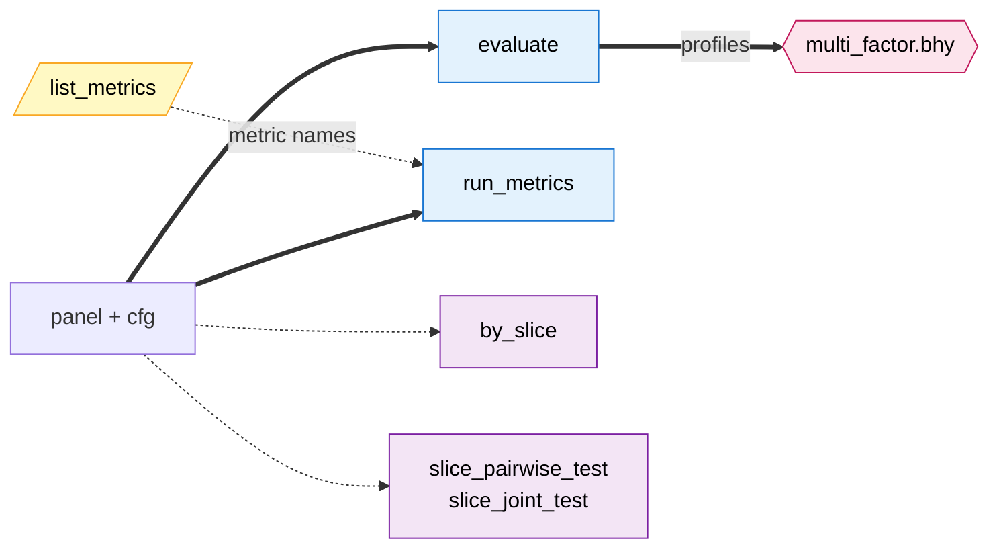

# factrix

**Does this factor possess predictive edge?** factrix is the first Polars-native Python toolkit that picks the right statistical test for each factor type. Cross-sectional, event, common factor — each gets the tests that fit its data-generating process.

## Verb map

The seven shipped verbs, coloured by category — **compute** (blue, produce primary artefacts), **decision** (pink, FDR), **view** (purple, slice surface), **introspection** (yellow). Solid arrow = hard signature dependency, dashed = suggested workflow. Click any node to jump to its API page. Full edge convention and the four future-design verbs (`compare`, `robustness`, `bhy_hierarchical`, `partial_conjunction` per #148) are described on the [API reference landing](api/index.md).

## Quick links

| If you want | Go to |
|---|---|
| **Install and run a smoke test** | [Installation](getting-started/install.md) · [Quickstart](getting-started/quickstart.md) |
| **Understand the three-axis design** (scope / signal / metric) | [Concepts](getting-started/concepts.md) |
| **Compare factrix against alphalens / qlib / peers** | [Where factrix fits](where-factrix-fits.md) |
| **Screen a batch of factors with BHY** | [Batch screening](guides/batch-screening.md) |
| **Slice any metric by regime / universe / sector** | [Slice analysis](guides/slice-analysis.md) |
| **Look up formulas and applicability** | [Metric applicability](reference/metric-applicability.md) |
| **Read every public symbol** | [API reference](api/index.md) |
| **Browse runnable notebooks** | [Examples](examples/index.md) |
| **Read the internal architecture** | [Architecture](development/architecture.md) |
