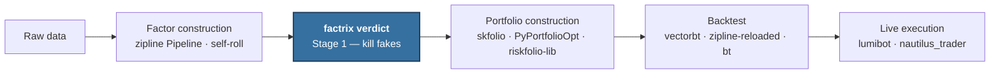
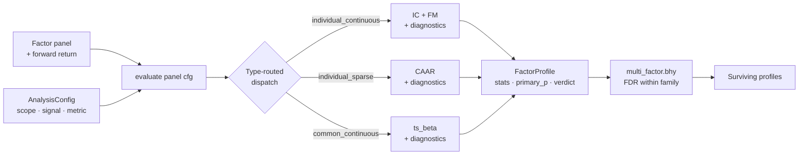

# Where factrix fits

This page is the depth companion to the README's "Where factrix fits"
block. It assumes you have read the hero claim and routing table on
the README; here we expand the design philosophy, walk through the
pipeline and internals, draw scope boundaries, compare against
same-purpose peers, show adjacent-tool integration, and disclose
honest weaknesses.

## 1. What factrix is

factrix is a **factor verdict surface**: given a candidate factor and
a forward return, it answers *is the predictive power real?* and
returns a structured profile of evidence. It is the first Python
framework to dispatch primary statistical tests by factor type rather
than applying one uniform formula to every factor.

Three factor types each get a primary test fitted to their
data-generating process:

- **Cross-sectional factors** — Information Coefficient (IC) and
  Fama-MacBeth (FM), both with Newey-West HAC standard errors and a
  Hansen-Hodrick lag floor for overlapping forward returns.
- **Event factors** — Cumulative Average Abnormal Return (CAAR) on
  the dense event-time calendar, with NW HAC inference and an
  overlap diagnostic when consecutive events sit within twice the
  forward horizon.
- **Common factors** — a factor whose realisation is shared across
  the cross-section in a given period (Fama-French market / size /
  value, or a macro variable). factrix tests these as a panel
  exposure, falling back to single-series β when only one asset is
  available.

Each type also runs a multi-metric *diagnostic battery* — never
collapsed into a single score. This is a deliberate design choice,
not an oversight. A composite score becomes its own optimisation
target the moment it ships (Goodhart 1984), and weighted aggregation
across heterogeneous nulls implicitly prices each null
(DeMiguel-Garlappi-Uppal 2009; Harvey 2017). See
[design notes §1](development/design-notes.md#1-no-composite-factor-score)
and
[§7](development/design-notes.md#7-per-metric-registered-procedures-rather-than-a-unified-test)
for the full citation chain.

## 2. Where factrix sits

### 2.1 Ecosystem pipeline

factrix is **Stage 1** of a multi-stage workflow. It is not a
competitor to portfolio construction, backtesting, or execution
tools — it sits upstream of them and produces the input they assume.

### 2.2 factrix internals

Inside factrix the call graph is small. A factor panel plus an
`AnalysisConfig` enters `evaluate()`, which routes to the registered
procedure for the (scope, signal, metric, mode) cell, runs the
primary test plus diagnostics, and returns a `FactorProfile`.
Multiple profiles flow into `multi_factor.bhy()` for cross-test FDR
control on the surviving subset.

The dispatch arrow is the single line that distinguishes factrix
from peers that apply one uniform formula across factor types
(see [§4](#4-vs-same-purpose-peers)).
