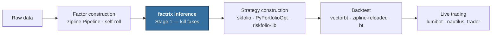
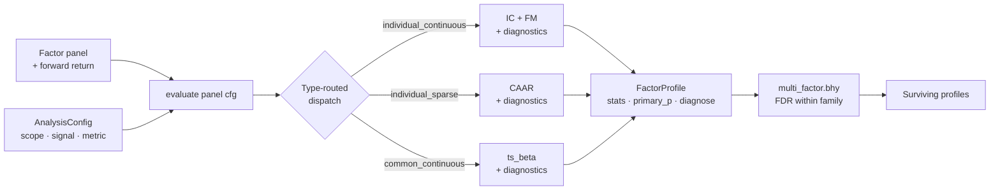
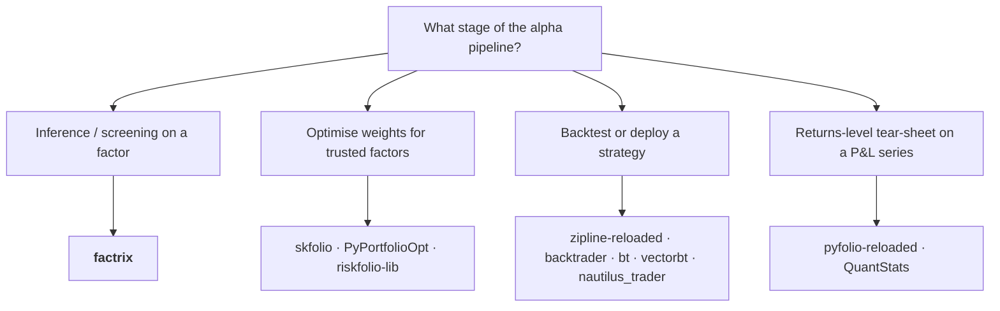

This page expands the design philosophy, walks through the pipeline
and internals, draws scope boundaries, compares against same-purpose
peers, shows adjacent-tool integration, and discloses honest
weaknesses.

## 1. What factrix is

factrix is a **factor inference surface**: given a candidate factor and
a forward return, it answers *is the predictive power real?* and
returns a structured profile of evidence — rather than applying one
uniform formula to every factor.

Three factor types each get a primary test fitted to their
data-generating process:

- **Cross-sectional factors** — Information Coefficient (IC) and
  Fama-MacBeth (FM), both with Newey-West HAC standard errors and a
  Hansen-Hodrick lag floor for overlapping forward returns.
- **Event factors** — Cumulative Average Abnormal Return (CAAR) on
  the dense event-time calendar, with NW HAC inference and an
  overlap diagnostic when consecutive events sit within twice the
  forward horizon.
- **Common factors** — a factor whose realisation is shared across
  the cross-section in a given period (Fama-French market / size /
  value, or a macro variable). factrix tests these as a panel
  exposure, falling back to single-series β when only one asset is
  available.

Each type also runs a multi-metric *diagnostic battery* — never
collapsed into a single score. This is a deliberate design choice,
not an oversight. A composite score becomes its own optimisation
target the moment it ships (Goodhart 1984), and weighted aggregation
across heterogeneous nulls implicitly prices each null
(DeMiguel-Garlappi-Uppal 2009; Harvey 2017). See
[design notes §1](development/design-notes.md#1-no-composite-factor-score)
and
[§7](development/design-notes.md#7-per-metric-registered-procedures-rather-than-a-unified-test)
for the full citation chain.

## 2. Where factrix sits

### 2.1 Ecosystem pipeline

factrix is **Stage 1** of a multi-stage workflow. It is not a
competitor to portfolio construction, backtesting, or execution
tools — it sits upstream of them and produces the input they assume.



### 2.2 factrix internals

Inside factrix the call graph is small. A factor panel plus an
`AnalysisConfig` enters `evaluate()`, which routes to the registered
procedure for the (scope, signal, metric, mode) cell, runs the
primary test plus diagnostics, and returns a `FactorProfile`.
Multiple profiles flow into `multi_factor.bhy()` for cross-test FDR
control on the surviving subset.



The dispatch arrow is the single line that distinguishes factrix
from peers that apply one uniform formula across factor types
(see [§4](#4-same-purpose-peers)).

## 3. Scope boundaries

What factrix deliberately does **not** do, and the canonical tool for
each. This is a commitment, not a TODO. To expand factrix scope,
update
[ARCHITECTURE.md Invariants](development/architecture.md#invariants)
first.

| Out of scope | Use instead |
|---|---|
| Portfolio optimisation (MVO / HRP / risk parity) | [skfolio](https://skfolio.org/), [PyPortfolioOpt](https://github.com/robertmartin8/PyPortfolioOpt), [riskfolio-lib](https://github.com/dcajasn/Riskfolio-Lib), cvxpy |
| ML signal layer | xgboost + shap |
| Regime detection methodology (HMM / threshold) | [hmmlearn](https://hmmlearn.readthedocs.io/), self-roll |
| Structural break detection (Chow / Bai-Perron) | [ruptures](https://centre-borelli.github.io/ruptures-docs/) |
| GARCH / wild-bootstrap SE | [arch](https://github.com/bashtage/arch) |
| Persistent-predictor auto-correction (IVX / Stambaugh) | [arch](https://github.com/bashtage/arch), R `ivx` (factrix flags via ADF; does not auto-correct) |
| Backtest / execution / slippage / margin | [vectorbt](https://github.com/polakowo/vectorbt), [bt](https://github.com/pmorissette/bt), [zipline-reloaded](https://github.com/stefan-jansen/zipline-reloaded), backtrader |
| Intraday / HFT (tick-level) | dedicated tooling |
| Cross-factor signal combiner | self-roll, scikit-learn |
| Composite factor scoring across dimensions | [AlphaEval](https://github.com/LeoDingggg/AlphaEval) (different design philosophy — see [§4.4](#44-alphaeval)) |
| Deflated / probabilistic / Haircut Sharpe | [mlfinlab](https://github.com/hudson-and-thames/mlfinlab) (commercial); roadmap gap for factrix — see [§7](#7-honest-weaknesses) |
| Cross-sectional factor *construction* DSL | [zipline-reloaded Pipeline](https://github.com/stefan-jansen/zipline-reloaded); factrix consumes Pipeline output |
| Returns-level tear-sheet (downstream of factrix) | [pyfolio-reloaded](https://github.com/stefan-jansen/pyfolio-reloaded) |

### 3.1 Rationale for the controversial rows

Three rows surprise readers most often. Their rationale is anchored
in design notes rather than restated here.

**Composite factor scoring** — rejected for the reason a single
weighted score becomes its own target the instant it ships
(Goodhart 1984), and weighted aggregation across heterogeneous
nulls implicitly prices each null without disclosing the price.
factrix exposes per-metric pass/fail and keeps the user in the
inference loop. See
[design notes §1](development/design-notes.md#1-no-composite-factor-score).

**ML signal layer** — out of scope as a deliberate boundary. The
signal-generation problem is well served by xgboost + shap, and
folding model fit into factrix would change the page's hero claim
from "inference on a hypothesised factor" to "inference on a fitted
model" — those need different statistical machinery (cross-validation
schemes, leakage tests). qlib already covers the integrated
pipeline; we leave that branch to qlib.

**Persistent-predictor flagging only, not auto-correction** —
when the cross-sectional or time-series predictor is highly
persistent (ADF p > 0.10), factrix raises
`PERSISTENT_REGRESSOR` and notes that the β estimate may carry
Stambaugh (1999) bias. It does not silently swap in IVX
(Phillips-Magdalinos), Stambaugh-correction, or sign-restricted
inference, because the right correction depends on the
researcher's economic prior — IVX assumes a near-unit-root
predictor; Stambaugh requires a specified innovation-correlation
sign. Auto-correcting would mask the modelling choice. Reach for
[arch](https://github.com/bashtage/arch) or R `ivx` when the flag
fires.

## 4. Same-purpose peers

Six peers occupy the *factor-evaluation / hypothesis-test* space.
Each subsection follows the same shape: positioning, where the peer
wins, where factrix wins, and the user profile that should pick the
peer instead. Code side-by-side snippets are tracked separately as
[#143](https://github.com/awwesomeman/factrix/issues/143) and will
land here once the migration examples are validated against the same
input panel both ways.

### 4.1 alphalens-reloaded

**Positioning** — alphalens-reloaded is the canonical pandas
tear-sheet for cross-sectional factors; the `get_clean_factor_and_
forward_returns` → `create_full_tear_sheet` flow is the vocabulary
most working quants recognise on sight. factrix targets the same
*hypothesis-test* slot but extends past CS-only and past
pandas-bound performance.

**Where alphalens wins**

- Tear-sheet vocabulary every quant recognises; fastest path to a
  publishable chart pack from a notebook.
- pandas-native — drops into existing notebooks without a polars
  conversion step.
- Six years of community examples and Stack Overflow answers.

**Where factrix wins**

- IC inference uses NW HAC with a Hansen-Hodrick lag floor for
  overlapping forward returns; alphalens applies a naive
  `scipy.stats.ttest_1samp` on the IC time series ([source](https://github.com/stefan-jansen/alphalens-reloaded)),
  which is biased when forward windows overlap.
- Multiple-testing correction (BHY) is built into the screening
  surface; alphalens has no batch-level FDR control by design.
- Type-routed dispatch — alphalens is CS-only by design; factrix
  also covers event and common-factor hypotheses without the user
  re-implementing the test machinery.

**When to pick alphalens instead** — you have a single CS factor,
your existing toolchain is pandas-only, and the tear-sheet
vocabulary matters more than the inference rigour.

### 4.2 qlib factor layer

**Positioning** — qlib is a full alpha → model → backtest → live
platform. Its factor-evaluation surface (`qlib.contrib.eva.alpha`)
is a thin utility under that platform, not the product.

**Where qlib wins**

- Industrial-scale data layer with caching and an integrated
  backtest engine — pick qlib when you want one tool for the whole
  pipeline.
- Alpha158 / Alpha360 baselines and RD-Agent integration give an
  ML-first research workflow.
- Largest active community among peers in this list.

**Where factrix wins**

- qlib's `calc_ic` / `calc_all_ic` apply uniform IC + Rank-IC
  across **every** factor regardless of type ([source](https://github.com/microsoft/qlib/blob/main/qlib/contrib/eva/alpha.py)).
  factrix dispatches IC, FM, CAAR, or ts-β by factor type.
- factrix is decoupled from any data store, signal-mining DSL, or
  backtest engine. You can drop it into an existing pipeline; qlib
  expects you to adopt its data layout.
- factrix ships per-metric NW HAC, BHY FDR, and persistent-predictor
  flagging as first-class outputs of `evaluate()`; in qlib these
  live in scattered helper functions or are absent.

**When to pick qlib instead** — you want one integrated platform
covering data → factor → ML model → backtest → live, and the
opinionated qlib data store is acceptable.

### 4.3 linearmodels

**Positioning** — linearmodels (Kevin Sheppard, statsmodels core)
is the reference Python implementation of panel econometrics:
HAC kernels (Bartlett / Parzen / QS with auto-bandwidth),
clustered SE, and a correctly-implemented Fama-MacBeth
second-stage SE. It is a primitive, not a framework.

**Where linearmodels wins**

- Best-in-class HAC and clustered SE coverage; correct FM
  second-stage variance (most homebrew loops are wrong by a
  constant factor).
- Maintained by an econometrics-credible author with frequent
  releases.

**Where factrix wins**

- linearmodels is a panel-econometrics toolkit; it has no factor
  tear-sheet, no IC surface, no event-study path, no batch
  multiple-testing layer. The user must already have a panel and
  know which test to run.
- factrix uses `arch` for HAC kernels (Kevin Sheppard maintains
  both `arch` and `linearmodels`; their HAC implementations are
  functionally equivalent) and treats FM as one routed metric
  among several. You are not asked to assemble the workflow.

**When to pick linearmodels instead** — you only need correct
Fama-MacBeth standard errors on a panel you have already
constructed, and you do not need IC, CAAR, BHY, or any of the
inference surfaces.

### 4.4 AlphaEval

**Positioning** — AlphaEval ([repo](https://github.com/LeoDingggg/AlphaEval))
is a *post-processing ranker for formula-mined alphas*: input
qlib expression-DSL formulas, compose them via `WeightCalculator`,
score the composite across five dimensions including an
OpenAI-LLM-as-judge for "financial logic". Its target user mines
1000 GP/GA formulas and needs to rank them.

This is the design path factrix considered and rejected with
literature backing — see
[design notes §1](development/design-notes.md#1-no-composite-factor-score)
and
[§7](development/design-notes.md#7-per-metric-registered-procedures-rather-than-a-unified-test).

**Where AlphaEval wins**

- Purpose-built for formula-mining workflows; LLM-judged
  "financial logic" dimension is unique.
- Composite ranker is the right tool when the input is a *pool*
  of mined alphas rather than a small set of hypothesised
  factors.

**Where factrix wins**

- factrix evaluates one factor (or batch with FDR) against an
  explicit null and surfaces per-metric pass/fail rather than a
  weighted scalar. The two libraries answer different questions.
- Composite scoring becomes its own optimisation target the
  moment it ships (Goodhart 1984); per-metric inference keeps the
  null distributions distinct.

**When to pick AlphaEval instead** — you mine formula alphas
with GP/GA and need to rank thousands by an aggregate score for
downstream selection.

### 4.5 eventstudy

**Positioning** — `eventstudy` is the only dedicated event-study
Python package. It implements the standard parametric / BMP /
Patell tests on event windows. The package self-describes as
alpha-quality with a frequently-changing API.

**Where eventstudy wins**

- BMP / Patell standardised tests for event-window inference are
  shipped with vocabulary that matches MacKinlay (1997).

**Where factrix wins**

- factrix integrates event CAAR with NW HAC and an overlap
  diagnostic on the dense event-time calendar; eventstudy treats
  events in isolation.
- Event inference lives in the same `FactorProfile` shape as CS and
  common-factor inferences; one pipeline screens all three with
  shared FDR control.

**When to pick eventstudy instead** — you only do M&A or
earnings event studies in isolation and do not need integration
with cross-sectional or macro work.

### 4.6 mlfinlab

**Positioning** — mlfinlab is the López de Prado reference
implementation of deflated / probabilistic / Haircut Sharpe,
PBO via combinatorial CV, BHY-adjusted p-values, and a
structural-break suite (Chow / CUSUM / SADF). It went
commercial in 2022; the public PyPI package was removed and the
public repo has been dormant since 2021-12.

**Where mlfinlab wins**

- The only library shipping deflated / probabilistic / Haircut
  Sharpe end-to-end. If your firm has the licence, this is the
  shortest path to those metrics.

**Where factrix wins**

- Open source (Apache-2.0); `pip install factrix` works.
- Active maintenance and a published changelog cadence.
- Deflated Sharpe / PSR is on the factrix roadmap and is the
  highest-priority OSS gap; see [§7](#7-honest-weaknesses).

**When to pick mlfinlab instead** — your firm pays for the
licence and you need deflated Sharpe today.

## 5. Adjacent tools and integration

The tools below are not peers; they sit upstream, downstream, or
underneath factrix. The point of this section is to make the
integration surface explicit so factrix reads as a citizen of the
ecosystem rather than a walled garden.

### 5.1 Per-tool role

| Tool | Role relative to factrix |
|---|---|
| [zipline-reloaded Pipeline](https://github.com/stefan-jansen/zipline-reloaded) | Upstream CS factor *construction* DSL; factrix consumes Pipeline output |
| [arch](https://github.com/bashtage/arch) | Reference HAC kernel implementation; factrix depends on it, does not reimplement |
| [statsmodels](https://www.statsmodels.org/) | General econometrics primitives (regression / time-series); used internally |
| [empyrical-reloaded](https://github.com/stefan-jansen/empyrical-reloaded) | Low-level return-stat primitives (Sharpe, Sortino, drawdown); dependency layer |
| [pyfolio-reloaded](https://github.com/stefan-jansen/pyfolio-reloaded) | Downstream returns-level tear-sheet; consumes strategy P&L, not factor signal |
| [vectorbt](https://github.com/polakowo/vectorbt) | Stage 3 parameter-grid backtest engine; pairs with factrix BHY for honest workflow |
| [skfolio](https://skfolio.org/) / [PyPortfolioOpt](https://github.com/robertmartin8/PyPortfolioOpt) / [riskfolio-lib](https://github.com/dcajasn/Riskfolio-Lib) | Stage 2 strategy construction (portfolio optimisation); consume factrix-validated factors as input |

### 5.2 Integration sketches

Stage 1 → factrix: zipline Pipeline outputs a pandas MultiIndex
`(date, asset)`, which converts to the polars panel factrix
expects in two lines.

```python
import polars as pl
import factrix as fx
from factrix.preprocess import compute_forward_return

# zipline_out: pandas DataFrame with MultiIndex (date, asset),
# columns include the factor value and the realised return.
panel = pl.from_pandas(zipline_out.reset_index())
panel = compute_forward_return(panel, forward_periods=5)

cfg = fx.AnalysisConfig.individual_continuous(
    metric=fx.Metric.IC, forward_periods=5,
)
profile = fx.evaluate(panel, cfg)
primary_p = profile.primary_p
```

factrix → Stage 2: surviving profiles after BHY feed a portfolio
optimiser.

```python
import factrix as fx

# Each panel carries its factor under a distinct column name
# ("momentum_12" / "value" / ...); evaluate auto-stamps factor_id
# from factor_col so identities stay unique without manual surgery.
profiles  = [
    fx.evaluate(p, cfg, factor_col=name) for name, p in panels.items()
]
survivors = fx.multi_factor.bhy(profiles, q=0.05)

# survivors is a list[FactorProfile]; pass the underlying factor
# panels to skfolio / PyPortfolioOpt / riskfolio-lib as Stage 2 input
```

The integration story matters because it answers the implicit
"what do I do with the inference" question — factrix is an
intermediate stage, not an endpoint.

## 6. When factrix is NOT the right tool

If you are not at the inference / screening stage, factrix is the
wrong tool. The chart below routes you to the canonical
alternative for each adjacent stage. Construction (upstream) is
intentionally not branched: readers reach this chart asking
*given I have a factor, what do I do next*, not *how do I build
one*.



## 7. Honest weaknesses

This section is the disclosure surface. It is meant to be cited
verbatim by skeptical readers — soft-pedalling the gaps would be
self-defeating once they read the source.

### 7.1 Capability matrix and roadmap

| Capability | factrix today | Closest peer | Status / roadmap |
|---|---|---|---|
| CS IC/IR tear-sheet | yes | alphalens (legacy, pandas) | parity on visualization vocabulary |
| Event CAAR + HAC | yes | eventstudy (alpha-quality) / linearmodels (manual) | event CAAR with NW HAC out of the box |
| Macro panel | yes | linearmodels (manual) | packaged macro-factor evaluation surface |
| Multi-test FDR (BHY) | yes | mlfinlab (commercial-gated) | only OSS implementation post-mlfinlab paywall |
| NW HAC | yes | linearmodels / arch | depend on `arch`, do not reimplement |
| Type-routed primary metric (CS / Event / Macro) | yes | none | factrix's core differentiation |
| **Deflated Sharpe / PSR / PBO** | **no** | mlfinlab (commercial-gated) | **roadmap priority** — most painful OSS gap |
| ML pipeline integration | no (out of scope) | qlib | document interop; leave to qlib |
| Live trading / execution | no (out of scope) | lumibot / nautilus_trader | document boundary; leave out |

### 7.2 Non-capability weaknesses

- **Smaller community** compared with alphalens / qlib — factrix is a newer
  project with fewer Stack Overflow answers. Expect to read source
  for edge cases that alphalens has been asked about for six years.
- **No published replication of a canonical anomaly study yet** —
  a factor-zoo skeptic will ask whether factrix's conclusions agree
  with the published record on a known-good factor. That
  replication is on the roadmap and is a credibility gap until it
  ships.

## Next steps

If this page resolved the fit question and you want to run factrix:

- [Quickstart](getting-started/quickstart.md) — 30-second example from a raw panel to a `primary_p` readout.
- [Concepts](getting-started/concepts.md) — the three-axis taxonomy and the metric dispatch underneath the routing examples above.
- [Choosing a metric](guides/choosing-metric.md) — research-question to metric mapping for the five scenarios in §2.

If you want to compare factrix to a specific peer before installing, the [§4 same-purpose peers](#4-same-purpose-peers) table is the densest summary on this page.

## 8. Citations

The methodological choices on this page anchor in the following
sources. The full bibliography lives in
[reference/bibliography.md](reference/bibliography.md); this
section names the most load-bearing ones.

- [**Goodhart (1984)**](reference/bibliography.md#goodhart-1984) —
  *Monetary Theory and Practice*. Origin of the Goodhart's-law
  argument used by design-notes §1.
- [**DeMiguel, Garlappi & Uppal (2009)**](reference/bibliography.md#demiguel-garlappi-uppal-2009) —
  "Optimal versus naive diversification." *Review of Financial
  Studies*. Equal-weight beats optimised under estimation error;
  cited in the no-composite position.
- [**Harvey (2017)**](reference/bibliography.md#harvey-2017) —
  "Presidential address: The scientific outlook in financial
  economics." *Journal of Finance*. Argues for pre-registered
  per-metric audit trails over unified statistics.
- **Bailey & López de Prado (2014)** — "The Deflated Sharpe
  Ratio." *Journal of Portfolio Management*. Roadmap target for
  the §7 PSR row. (Not yet in bibliography; will land alongside
  the Deflated-Sharpe roadmap work.)
- [**Harvey, Liu & Zhu (2016)**](reference/bibliography.md#harvey-liu-zhu-2016) —
  "…and the cross-section of expected returns." *Review of
  Financial Studies*. Multiple-testing inflation in the factor
  zoo; motivates BHY.
- [**Hou, Xue & Zhang (2020)**](reference/bibliography.md#hou-xue-zhang-2020) —
  "Replicating anomalies." *Review of Financial Studies*. The
  replication context for the §7.2 weakness disclosure.
- [**Brown & Warner (1985)**](reference/bibliography.md#brown-warner-1985) —
  "Using daily stock returns: The case of event studies."
  *Journal of Financial Economics*. The canonical event-study
  reference behind CAAR.
- [**MacKinlay (1997)**](reference/bibliography.md#mackinlay-1997) —
  "Event studies in economics and finance." *Journal of
  Economic Literature*. Vocabulary used in
  [§1](#1-what-factrix-is) and [§4.5](#45-eventstudy).
