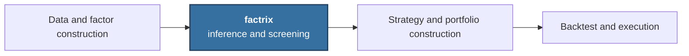

factrix sits between factor construction and strategy construction. It tests
whether a candidate signal has predictive evidence and, when many candidates
are screened together, controls the false discovery rate (FDR). It does not
turn that evidence into positions or a backtest.

{ #1-what-factrix-is }

## Scope

factrix routes metrics by factor scope, signal density, and data structure.
The caller chooses the research question and metrics; factrix validates that
the requested metrics apply to the supplied data.

| Factor type | Typical question | Mainstream evidence |
|---|---|---|
| Cross-sectional | Do higher-ranked assets earn different forward returns? | Information Coefficient (IC), Fama-MacBeth regression, and spread diagnostics |
| Event | Do sparse signals precede abnormal returns? | Cumulative Average Abnormal Return (CAAR), standardised abnormal returns, and rank tests |
| Common | Does one shared factor explain the cross-section? | Cross-asset beta and conditional-response diagnostics |

`evaluate()` returns a mapping keyed by factor name. Each
`EvaluationResult` keeps metric results, warnings, the detected cell, and
sample metadata separate. factrix does not collapse heterogeneous tests into
a composite score.

```mermaid
flowchart LR
    DATA[Data and factor construction] --> FX[<b>factrix</b><br/>inference and screening]
    FX --> PORT[Strategy and portfolio construction]
    PORT --> BT[Backtest and execution]
    classDef here fill:#3670A0,color:#fff,stroke:#234060,stroke-width:2px;
    class FX here
```

For the data-shape taxonomy, see [Concepts](getting-started/concepts.md). For
the internal dispatch and execution model, see
[Architecture](development/architecture.md).

## Boundaries

Use factrix when the unit of analysis is a factor hypothesis. Use a downstream
or specialised tool when the unit is a portfolio, order, fitted machine-learning
model, or return series.

| Need | factrix | Use instead |
|---|---:|---|
| Factor-type-aware inference | Yes | — |
| FDR control across candidate factors | Yes | — |
| Data validation and applicability checks | Yes | — |
| Factor construction DSL | No | [zipline-reloaded Pipeline](https://zipline.ml4trading.io/) or your research pipeline |
| Portfolio optimisation | No | [skfolio](https://skfolio.org/), [PyPortfolioOpt](https://pyportfolioopt.readthedocs.io/), or [riskfolio-lib](https://riskfolio-lib.readthedocs.io/) |
| Strategy backtesting and execution | No | [vectorbt](https://vectorbt.dev/), [zipline-reloaded](https://zipline.ml4trading.io/), [bt](https://pmorissette.github.io/bt/), or an execution engine |
| Return-series tear sheets | No | [pyfolio-reloaded](https://pyfolio.ml4trading.io/) or [QuantStats](https://github.com/ranaroussi/quantstats) |
| Machine-learning model training | No | [Qlib](https://github.com/microsoft/qlib), scikit-learn, or your model pipeline |
| Persistent-predictor correction | No; factrix warns | A model chosen for the research design, such as IVX or a Stambaugh correction |

These are scope boundaries, not roadmap promises. Adding a new inference
method can fit factrix; adding portfolio or execution state changes the
library's purpose.

## Related tools

The tools below overlap with part of the workflow but answer different primary
questions. The comparison stays at the level of documented product scope; it
does not rank communities, maintenance activity, or implementation quality.

| Tool | Primary use | Choose it when |
|---|---|---|
| [alphalens-reloaded](https://github.com/stefan-jansen/alphalens-reloaded) | Cross-sectional factor statistics, plots, and tear sheets | You want the established Alphalens workflow and visual vocabulary for a pandas factor dataset |
| [linearmodels](https://bashtage.github.io/linearmodels/) | Panel, instrumental-variable, system, and asset-pricing estimators | You already know the econometric model and need lower-level estimator or covariance control |
| [eventstudy](https://github.com/LemaireJean-Baptiste/eventstudy) | Focused financial event-study analysis | Your workflow is an isolated event study rather than a mixed factor-screening pipeline |
| [Qlib](https://github.com/microsoft/qlib) | An AI-oriented quantitative platform spanning data, models, backtests, and execution | You want an integrated research platform rather than an inference-only component |
| [AlphaEval](https://github.com/GAIR-NLP/AlphaEval) | Evaluation of mined alpha formulas | Your main problem is ranking or analysing a large formula-mining output |
| [mlfinlab](https://github.com/hudson-and-thames/mlfinlab) | Commercial financial-machine-learning tooling | You need methods available in that licensed suite, such as its backtest-overfitting tools |

No single row is a drop-in substitute for every factrix factor type. It is also
reasonable to use these tools together: for example, construct a factor in a
research platform, validate it with factrix, then send surviving factors to a
portfolio optimiser and backtest engine.

## Design trade-offs

- **No composite factor score.** A single score hides the null hypothesis and
  the price assigned to each diagnostic. factrix keeps results separate; see
  [Design notes](development/design-notes.md#1-no-composite-factor-score).
- **Warnings do not silently change estimators.** Persistence, thin samples,
  event clustering, and uneven grids remain visible in the result. The caller
  decides whether to change the sample or method.
- **Calibration has explicit limits.** Statistical defaults are measured on
  documented nulls, but not every finite-sample regime is calibrated. See
  [Statistical methods](reference/statistical-methods.md) and the linked
  validation evidence before interpreting a borderline p-value.
- **Factor evidence is not strategy evidence.** A predictive factor can still
  fail after turnover, costs, capacity limits, and portfolio constraints. Those
  questions belong downstream.

## Next steps

- [Quickstart](getting-started/quickstart.md) — run an end-to-end evaluation.
- [Choosing a metric](guides/choosing-metric.md) — map a hypothesis to a metric.
- [Reading results](guides/reading-results.md) — interpret estimates, metadata,
  and warnings.
- [Validating allocation signals](guides/validating-allocation-signals.md) —
  carry inference forward without treating it as portfolio optimisation.
